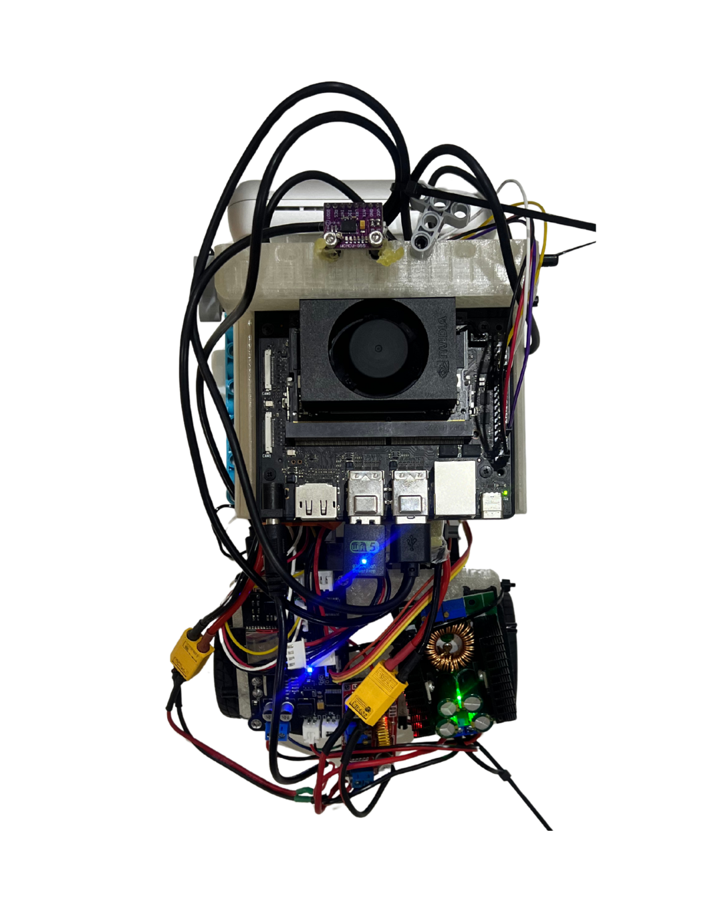
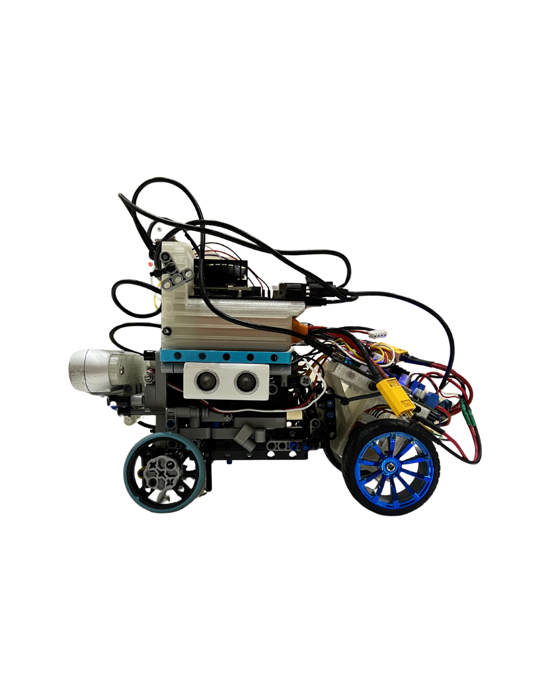
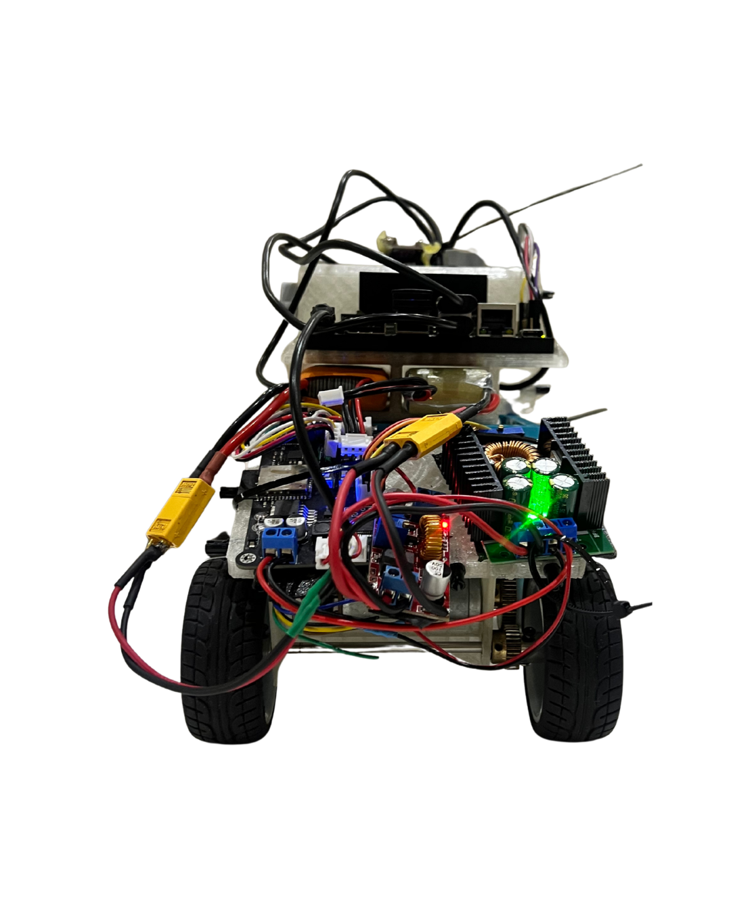

Engineering materials
====

This repository contains engineering materials of a self-driven vehicle's model participating in the WRO Future Engineers competition in the season 2022.

## Content

* `t-photos` contains 2 photos of the team (an official one and one funny photo with all team members)
* `v-photos` contains 6 photos of the vehicle (from every side, from top and bottom)
* `video` contains the video.md file with the link to a video where driving demonstration exists
* `schemes` contains one or several schematic diagrams in form of JPEG, PNG or PDF of the electromechanical components illustrating all the elements (electronic components and motors) used in the vehicle and how they connect to each other.
* `src` contains code of control software for all components which were programmed to participate in the competition
* `models` is for the files for models used by 3D printers, laser cutting machines and CNC machines to produce the vehicle elements. If there is nothing to add to this location, the directory can be removed.
* `other` is for other files which can be used to understand how to prepare the vehicle for the competition. It may include documentation how to connect to a SBC/SBM and upload files there, datasets, hardware specifications, communication protocols descriptions etc. If there is nothing to add to this location, the directory can be removed.

## Introduction

_This part must be filled by participants with the technical clarifications about the code: which modules the code consists of, how they are related to the electromechanical components of the vehicle, and what is the process to build/compile/upload the code to the vehicle’s controllers._


# IriSight — WRO Future Engineers 2026

<div align="center">
  
  <p><em>[TODO: Project tagline]</em></p>
</div>

## Quick Link - Explore the project

<table width="100%">
  <tr>
    <td width="25%" align="center" valign="top">
      <a href="src/"><strong>💻 Software</strong></a><br>
      <sub>Jetson and ESP32 control code</sub>
    </td>
    <td width="25%" align="center" valign="top">
      <a href="schemes/"><strong>🔌 Schematics</strong></a><br>
      <sub>Wiring, power, and system diagrams</sub>
    </td>
    <td width="25%" align="center" valign="top">
      <a href="models/"><strong>🧩 CAD &amp; Mechanics</strong></a><br>
      <sub>Mechanical design and printable files</sub>
    </td>
    <td width="25%" align="center" valign="top">
      <a href="other/"><strong>📊 Engineering Journal</strong></a><br>
      <sub>Tests, calibration, and decisions</sub>
    </td>
  </tr>
  <tr>
    <td width="25%" align="center" valign="top">
      <a href="v-photos/"><strong>🚗 Vehicle Photos</strong></a><br>
      <sub>Required views of the final robot</sub>
    </td>
    <td width="25%" align="center" valign="top">
      <a href="t-photos/"><strong>👥 Team Photos</strong></a><br>
      <sub>Official and informal team photos</sub>
    </td>
    <td width="25%" align="center" valign="top">
      <a href="video/video.md"><strong>🎥 Videos</strong></a><br>
      <sub>Autonomous challenge demonstrations</sub>
    </td>
    <td width="25%" align="center" valign="top">
      <a href="plan.md"><strong>✅ Documentation Plan</strong></a><br>
      <sub>Evidence and submission checklist</sub>
    </td>
  </tr>
</table>

## Contents

- [Meet the team](#meet-the-team)
- [Meet the vehicle](#meet-the-vehicle)
- [Performance videos](#performance-videos)
- [How IriSight works](#how-irisight-works)
- [Our engineering journey](#our-engineering-journey)
- [Mobility and mechanical design](#mobility-and-mechanical-design)
- [Power and sensor architecture](#power-and-sensor-architecture)
- [Software and challenge strategy](#software-and-challenge-strategy)
- [System integration, testing, and risk](#system-integration-testing-and-risk)
- [Reproducing IriSight](#reproducing-irisight)
- [Current limitations and next improvements](#current-limitations-and-next-improvements)
- [Repository structure](#repository-structure)
- [Version history](#version-history)

## Meet the team

<div align="center">
  
  <p><em>[TODO: Official team-photo caption and names from left to right]</em></p>
</div>

<table width="100%">
  <tr>
    <td width="50%" align="center" valign="top">
      <br>
      <strong>[TODO: Member 1 name]</strong><br><br>
      <p align="left">
        <strong>Role:</strong> [TODO]<br><br>
        <strong>Origin:</strong> [TODO]<br><br>
        <strong>Email:</strong> [TODO]<br><br>
        <strong>Bio:</strong> [TODO]
      </p>
    </td>
    <td width="50%" align="center" valign="top">
      <br>
      <strong>[TODO: Member 2 name]</strong><br><br>
      <p align="left">
        <strong>Role:</strong> [TODO]<br><br>
        <strong>Origin:</strong> [TODO]<br><br>
        <strong>Email:</strong> [TODO]<br><br>
        <strong>Bio:</strong> [TODO]
      </p>
    </td>
  </tr>
  <tr>
    <td width="50%" align="center" valign="top">
      <br>
      <strong>[TODO: Member 3 name]</strong><br><br>
      <p align="left">
        <strong>Role:</strong> [TODO]<br><br>
        <strong>Origin:</strong> [TODO]<br><br>
        <strong>Email:</strong> [TODO]<br><br>
        <strong>Bio:</strong> [TODO]
      </p>
    </td>
    <td width="50%" align="center" valign="top">
      <br>
      <strong>[TODO: Coach name]</strong><br><br>
      <p align="left">
        <strong>Role:</strong> Team Coach<br><br>
        <strong>Origin:</strong> [TODO]<br><br>
        <strong>Email:</strong> [TODO]<br><br>
        <strong>Bio:</strong> [TODO]
      </p>
    </td>
  </tr>
</table>

## Meet the vehicle

### Final vehicle gallery
| | |
| :---: | :---: |
|  |  |
| **Top** | **Bottom** |
|  |  |
| **Left** | **Right** |
|  |  |
| **Front** | **Back** |
### Key specifications

| Specification | Final value |
| --- | --- |
| Length × width × height | [TODO] |
| Mass | [TODO] |
| Wheelbase / track width | [TODO] |
| Ground clearance | [TODO] |
| Drive layout | One motor, two gears, one drive shaft, two driven rear wheels |
| Steering layout | LEGO-based parallel front steering system|
| Main computer | NVIDIA Jetson Orin Nano, Ubuntu 22.04 LTS |
| Microcontroller | ESP32 |
| Primary camera | Intel RealSense D455 |
| IMU | BNO055 breakout |
| Additional sensors | Two side ultrasonic sensors |
| Front wheels | LEGO SPIKE blue wheels, part `39367` |
| Rear wheels | [TODO: Exact model-car wheels] |
| Batteries | Separate Jetson and motor/actuator batteries |

## Performance videos

| Challenge | Video | Robot version | Result |
| --- | --- | --- | --- |
| Open Challenge | [TODO: YouTube link] | [TODO] | [TODO] |
| Obstacle Challenge | [TODO: YouTube link] | [TODO] | [TODO] |
| Parking | [TODO: Video/timestamp] | [TODO] | [TODO] |
| Project overview | [TODO: Optional summary video] | [TODO] | [TODO] |

## How IriSight works

[TODO: System overview]

### System architecture

[TODO: System block diagram]

| Flow | Summary |
| --- | --- |
| Power | [TODO] |
| Perception | [TODO] |
| Decision | [TODO] |
| Actuation | [TODO] |
| Feedback and safety | [TODO] |

## Our engineering journey

[TODO: Development story]

| Version/date | Problem or goal | Change | Evidence | Result and next decision |
| --- | --- | --- | --- | --- |
| Concept | Ackermann steering | [TODO] | [TODO] | Parallel steering selected |
| Prototype 1 | [TODO] | [TODO] | [TODO] | [TODO] |
| Prototype 2 | [TODO] | [TODO] | [TODO] | [TODO] |
| Final | [TODO] | [TODO] | [TODO] | [TODO] |

## Mobility and mechanical design

### Chassis and component mounting

IriSight uses a LEGO-based chassis so the team can change the geometry and component positions without manufacturing an entirely new frame. The Jetson is protected by a custom 3D-printed enclosure designed to connect directly to LEGO parts. The final dimensions, mass, mounting coordinates, rigidity checks, and center-of-mass measurements will be added after the mechanical configuration is frozen.

[TODO: Dimensioned mechanical diagram]

### Rear drive system

One DC motor drives two rear wheels. Its output passes through a two-gear transmission to a drive shaft connecting the rear wheels. The motor and rear-wheel models are carried over from the previous vehicle, but their exact identifiers, gear tooth counts, ratio, mounting, and measured performance remain to be documented for the 2026 build.

### Parallel steering system

The two front LEGO SPIKE `39367` wheels are steered by a larger servo through a LEGO parallel linkage. Ackermann steering was the original plan, but a suitable LEGO mechanism could not be completed within the available development time. The parallel mechanism was selected for the current vehicle; the final documentation will compare its geometry, steering play, turning radius, build complexity, and tire scrub with the attempted Ackermann design.

### Torque and speed summary

| Result | Final value | Evidence |
| --- | ---: | --- |
| Gear ratio | [TODO] | [TODO] |
| Calculated no-load speed | [TODO] | [TODO] |
| Measured vehicle speed | [TODO] | [TODO] |
| Required wheel torque | [TODO] | [TODO] |
| Available wheel torque | [TODO] | [TODO] |
| Torque margin | [TODO] | [TODO] |
| Stopping distance | [TODO] | [TODO] |

### Mechanical iterations

[TODO: Best mechanical comparison image]

[TODO: Mechanical iteration summary]

**Detailed evidence:** [mechanical design, calculations, CAD, assembly, and validation](models/)

## Power and sensor architecture

### Power architecture

[TODO: Wiring and power-tree diagram]

The vehicle uses two battery domains: one battery supplies the Jetson and its logic/sensing system, while a second battery supplies the motor-driver side. A regulator provides the required stable voltage. Exact battery, regulator, motor-driver, connector, protection, and current ratings are still being identified and will be verified against measured typical and peak current.

| Power domain | Source | Loads | Typical current | Peak current | Runtime/margin |
| --- | --- | --- | ---: | ---: | --- |
| Jetson/logic | [TODO] | [TODO] | [TODO] | [TODO] | [TODO] |
| Motor/actuator | [TODO] | [TODO] | [TODO] | [TODO] | [TODO] |

### Component and interface map

| Component | Exact model | Power | Interface | Purpose |
| --- | --- | --- | --- | --- |
| Jetson | NVIDIA Jetson Orin Nano | [TODO] | [TODO] | Main processing |
| ESP32 | [TODO: Board] | [TODO] | Serial | Actuator control |
| Motor driver | [TODO] | [TODO] | [TODO] | Drive-motor control |
| Steering servo | [TODO] | [TODO] | [TODO] | Front steering |
| D455 | Intel RealSense D455 | [TODO] | USB | Depth perception |
| IMU | [TODO: Exact BNO055 board] | [TODO] | I²C | Relative yaw |
| Left ultrasonic | [TODO] | [TODO] | [TODO] | [TODO] |
| Right ultrasonic | [TODO] | [TODO] | [TODO] | [TODO] |
| Jetson battery | [TODO] | [TODO] | — | Logic power |
| Motor battery | [TODO] | [TODO] | — | Actuator power |
| Regulator | [TODO] | [TODO] | — | Voltage regulation |

### Sensor placement and calibration

[TODO: Sensor-placement diagram]

| Sensor | Placement | Selection reason | Calibration | Limitation and mitigation |
| --- | --- | --- | --- | --- |
| D455 | [TODO] | [TODO] | [TODO] | [TODO] |
| BNO055 | [TODO] | [TODO] | [TODO] | [TODO] |
| Left ultrasonic | [TODO] | [TODO] | [TODO] | [TODO] |
| Right ultrasonic | [TODO] | [TODO] | [TODO] | [TODO] |

The D455 is the primary distance sensor used by the current Open Challenge programs. Its depth frame supplies a front region and one side-wall region. The BNO055 supplies relative yaw for ordered heading checkpoints and lap counting. The two ultrasonic sensors are additional left/right sensors, but their final role is not yet implemented in the current Open Challenge files.

**Detailed evidence:** [electrical architecture, wiring, power budget, sensor placement, calibration, and safety](schemes/)

## Software and challenge strategy

### Architecture and communication

[TODO: Software state machine/data-flow diagram]

The current Open Challenge system runs on the Jetson. It reads the RealSense D455 and BNO055, calculates steering and speed, and sends `DRIVE <steerDeg> <speed>` commands to the ESP32 through a 115200-baud serial connection. The ESP32-side firmware that converts these commands into motor-driver and steering-servo signals still needs to be added to the repository.

| Module | Responsibility | Inputs | Outputs |
| --- | --- | --- | --- |
| [`src/clockWise.py`](src/clockWise.py) | Left-wall depth following with counter-clockwise yaw checkpoints | D455 depth/color, BNO055 yaw | ESP32 drive command, web diagnostics |
| [`src/counterClockWise.py`](src/counterClockWise.py) | Right-wall depth following with clockwise yaw checkpoints | D455 depth/color, BNO055 yaw | ESP32 drive command, web diagnostics |
| `src/bno055_yaw.py` | [TODO] | BNO055 | Relative yaw and calibration status |
| ESP32 firmware | [TODO] | Jetson serial command | Motor-driver and servo control |

### Open Challenge

**Status:** Implemented for both directions.

Both programs align 640×480 depth and color frames at 30 FPS. They calculate the median of valid depth pixels inside front and side regions of interest, rejecting depths outside 0.15–4.00 m and requiring at least 50 valid pixels. On a straight, a PD controller maintains a 0.60 m side-wall target. If the side wall becomes unavailable, the program applies a small search steering command toward the missing wall.

When the median front distance reaches 0.60 m, the controller enters a fixed-steering corner state. It remains in that state until the front opens to 0.80 m, providing hysteresis so noise near one threshold does not repeatedly switch modes. Straight and corner speed commands are currently 200 and 180 on the program's 0–255 command scale. Steering is limited to ±35 degrees.

The BNO055 heading is zeroed at startup. Each program accepts the next expected 90-degree checkpoint within a ±10-degree zone, counts a lap only after all four checkpoints arrive in order, and stops after three laps plus a 0.5-second delay. A Flask diagnostic stream on port 5000 overlays the active mode, depth regions, steering, speed, yaw, lap count, and next checkpoint.

| Current control value | Value |
| --- | ---: |
| Side-wall target | 0.60 m |
| Front corner entry | 0.60 m |
| Front corner exit | 0.80 m |
| Proportional gain | 38.0 steering degrees/m |
| Derivative gain | 4.0 |
| Steering limit | ±35° |
| Straight/corner speed command | 200 / 180 |
| D455 stream | 640×480 at 30 FPS |
| Yaw checkpoint tolerance | ±10° |
| Required laps | 3 |

| Metric | Clockwise | Counter-clockwise | Test evidence |
| --- | ---: | ---: | --- |
| Trials | [TODO] | [TODO] | [TODO] |
| Successful three-lap runs | [TODO] | [TODO] | [TODO] |
| Success rate | [TODO] | [TODO] | [TODO] |
| Best/average completion time | [TODO] | [TODO] | [TODO] |
| Wall-distance error | [TODO] | [TODO] | [TODO] |

### Obstacle Challenge

**Status:** In development.

[TODO: Obstacle strategy, state machine, tuning, edge cases, and results]

### Parking

**Status:** In development.

[TODO: Parking strategy, state machine, tuning, edge cases, and results]

**Detailed evidence:** [software architecture, algorithms, tuning, installation, configuration, and tests](src/)

## System integration, testing, and risk

### Subsystem interaction

For the current Open Challenge, the D455 depth and BNO055 yaw enter the Jetson control loop. Depth determines wall-distance steering and corner transitions, while yaw independently advances the heading checkpoints used for lap counting. The Jetson sends the resulting steering and speed command to the ESP32, which controls the drive and steering hardware. The final system documentation will add measured sensor-to-actuator latency, ESP32 timeout behavior, power-fault behavior, and validation results.

### Final regression results

| Test | Configuration/commit | Trials | Acceptance target | Result | Evidence |
| --- | --- | ---: | --- | --- | --- |
| Open clockwise | [TODO] | [TODO] | [TODO] | [TODO] | [TODO] |
| Open counter-clockwise | [TODO] | [TODO] | [TODO] | [TODO] | [TODO] |
| Obstacle Challenge | [TODO] | [TODO] | [TODO] | [TODO] | [TODO] |
| Parking | [TODO] | [TODO] | [TODO] | [TODO] | [TODO] |
| Runtime/power | [TODO] | [TODO] | [TODO] | [TODO] | [TODO] |
| Emergency/fault response | [TODO] | [TODO] | [TODO] | [TODO] | [TODO] |

### Key decisions

| Decision | Alternatives | Evidence | Trade-off |
| --- | --- | --- | --- |
| Parallel steering | Ackermann steering | [TODO] | [TODO] |
| LEGO chassis with printed Jetson enclosure | [TODO] | [TODO] | [TODO] |
| D455 depth wall following | [TODO] | [TODO] | [TODO] |
| Separate power sources | [TODO] | [TODO] | [TODO] |

### Risk register

| Risk/failure mode | Detection | Mitigation | Validation |
| --- | --- | --- | --- |
| Steering play or scrub | [TODO] | [TODO] | [TODO] |
| Loose LEGO/printed mounting | [TODO] | [TODO] | [TODO] |
| Missing or invalid depth | [TODO] | [TODO] | [TODO] |
| IMU drift/interference | [TODO] | [TODO] | [TODO] |
| Jetson–ESP32 communication loss | [TODO] | [TODO] | [TODO] |
| Power sag or actuator stall | [TODO] | [TODO] | [TODO] |

**Detailed evidence:** [Engineering Journal, raw and processed tests, decisions, risks, and final regression results](other/)

## Reproducing IriSight

### Required files and tools

[TODO: Requirements summary and links]

### Mechanical assembly

[TODO: Assembly summary and link]

### Wiring and power-on

[TODO: Wiring, validation, and first-power-on summary and link]

### Software installation

```bash
# [TODO: Exact clean-install commands]
```

### Calibration

```text
[TODO: Calibration sequence]
```

### Start an autonomous run

```bash
# [TODO: Exact start commands]
```

### Pre-flight and acceptance test

[TODO: Pre-flight and acceptance-test summary]

## Current limitations and next improvements

| Limitation | Current effect | Planned improvement | Validation target |
| --- | --- | --- | --- |
| Obstacle Challenge incomplete | [TODO] | [TODO] | [TODO] |
| Parking incomplete | [TODO] | [TODO] | [TODO] |
| [TODO] | [TODO] | [TODO] | [TODO] |

## Repository structure

| Path | Contents |
| --- | --- |
| [`src/`](src/) | Control software, firmware, configuration, and software documentation |
| [`schemes/`](schemes/) | Wiring, power, sensor-placement, and system diagrams |
| [`models/`](models/) | Mechanical documentation, CAD, and printable files |
| [`other/`](other/) | Engineering Journal, tests, calibration, risks, and decision records |
| [`v-photos/`](v-photos/) | Front, rear, left, right, top, and bottom vehicle photographs |
| [`t-photos/`](t-photos/) | Official and informal team photographs |
| [`video/`](video/) | Challenge and project video links |

## Acknowledgements

[TODO]
