Engineering materials
====

This repository contains engineering materials of a self-driven vehicle's model participating in the WRO Future Engineers competition in the season 2022.

## Content

* `t-photos` contains 2 photos of the team (an official one and one funny photo with all team members)
* `v-photos` contains 6 photos of the vehicle (from every side, from top and bottom)
* `video` contains the video.md file with the link to a video where driving demonstration exists
* `schemes` contains one or several schematic diagrams in form of JPEG, PNG or PDF of the electromechanical components illustrating all the elements (electronic components and motors) used in the vehicle and how they connect to each other.
* `src` contains code of control software for all components which were programmed to participate in the competition
* `models` is for the files for models used by 3D printers, laser cutting machines and CNC machines to produce the vehicle elements. If there is nothing to add to this location, the directory can be removed.
* `other` is for other files which can be used to understand how to prepare the vehicle for the competition. It may include documentation how to connect to a SBC/SBM and upload files there, datasets, hardware specifications, communication protocols descriptions etc. If there is nothing to add to this location, the directory can be removed.

## Introduction

_This part must be filled by participants with the technical clarifications about the code: which modules the code consists of, how they are related to the electromechanical components of the vehicle, and what is the process to build/compile/upload the code to the vehicle’s controllers._


# IriSight — WRO Future Engineers 2026

_Repository of Team IriSight competing in the CRO 2026, Future Engineers category._


<div align="center">
  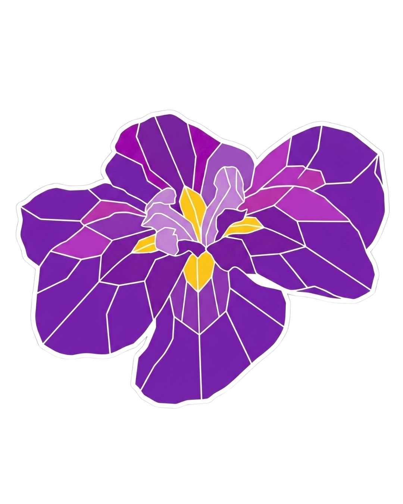
  <p><em>[TODO: Project tagline]</em></p>
</div>

## Quick Link - Explore the project

<table width="100%">
  <tr>
    <td width="33.33%" align="center" valign="top">
      <a href="src/"><strong>💻 Code</strong></a><br>
      <sub>Jetson and ESP32 control code</sub>
    </td>
    <td width="33.33%" align="center" valign="top">
      <a href="schemes/"><strong>🔌 Schematics</strong></a><br>
      <sub>Wiring, power, and electronics</sub>
    </td>
    <td width="33.33%" align="center" valign="top">
      <a href="models/"><strong>🧩 CAD models &amp; Mechanics</strong></a><br>
      <sub>Mechanical design and printable files</sub>
    </td>
  </tr>
  <tr>
    <td width="33.33%" align="center" valign="top">
      <a href="v-photos/"><strong>🚗 Vehicle Photos</strong></a><br>
      <sub>Required views of the final robot</sub>
    </td>
    <td width="33.33%" align="center" valign="top">
      <a href="t-photos/"><strong>👥 Team Photos</strong></a><br>
      <sub>Official and informal team photos</sub>
    </td>
    <td width="33.33%" align="center" valign="top">
      <a href="video/video.md"><strong>🎥 Videos</strong></a><br>
      <sub>Autonomous challenge demonstrations</sub>
    </td>
  </tr>
</table>

## Contents

- [Meet the team](#meet-the-team)
- [Meet the vehicle](#meet-the-vehicle)
- [Performance videos](#performance-videos)
- [How IriSight works](#how-irisight-works)
- [Our engineering journey](#our-engineering-journey)
- [Mobility and mechanical design](#mobility-and-mechanical-design)
- [Power and sensor architecture](#power-and-sensor-architecture)
- [Software and challenge strategy](#software-and-challenge-strategy)
- [System integration, testing, and risk](#system-integration-testing-and-risk)
- [Reproducing IriSight](#reproducing-irisight)
- [Current limitations and next improvements](#current-limitations-and-next-improvements)
- [Repository structure](#repository-structure)
- [Version history](#version-history)

## Meet the team

<div align="center">
  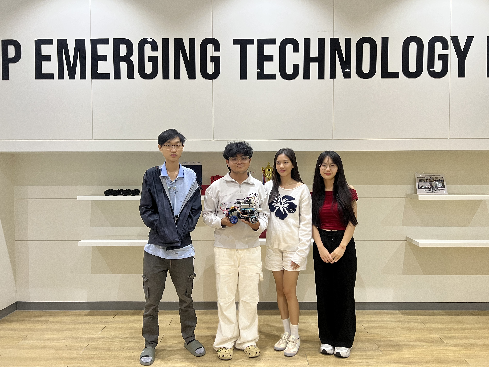
  <p><em>Team Photo - From left to right: Kimchour, Panha (Coach), Nita, and Muyleang.</em></p>
</div>

<table width="100%">
  <tr>
    <td width="50%" align="center" valign="top">
      <br>
      <strong>[TODO: Member 1 name]</strong><br><br>
      <p align="left">
        <strong>Role:</strong> [TODO]<br><br>
        <strong>Origin:</strong> [TODO]<br><br>
        <strong>Email:</strong> [TODO]<br><br>
        <strong>Bio:</strong> [TODO]
      </p>
    </td>
    <td width="50%" align="center" valign="top">
      <br>
      <strong>[TODO: Member 2 name]</strong><br><br>
      <p align="left">
        <strong>Role:</strong> [TODO]<br><br>
        <strong>Origin:</strong> [TODO]<br><br>
        <strong>Email:</strong> [TODO]<br><br>
        <strong>Bio:</strong> [TODO]
      </p>
    </td>
  </tr>
  <tr>
    <td width="50%" align="center" valign="top">
      <br>
      <strong>[TODO: Member 3 name]</strong><br><br>
      <p align="left">
        <strong>Role:</strong> [TODO]<br><br>
        <strong>Origin:</strong> [TODO]<br><br>
        <strong>Email:</strong> [TODO]<br><br>
        <strong>Bio:</strong> [TODO]
      </p>
    </td>
    <td width="50%" align="center" valign="top">
      <br>
      <strong>[TODO: Coach name]</strong><br><br>
      <p align="left">
        <strong>Role:</strong> Team Coach<br><br>
        <strong>Origin:</strong> [TODO]<br><br>
        <strong>Email:</strong> [TODO]<br><br>
        <strong>Bio:</strong> [TODO]
      </p>
    </td>
  </tr>
</table>

## Meet the vehicle
<div>
  
  <p><em>Vehicle 360º view (GIF)</em></p>
</div>

### Final vehicle gallery
|  | 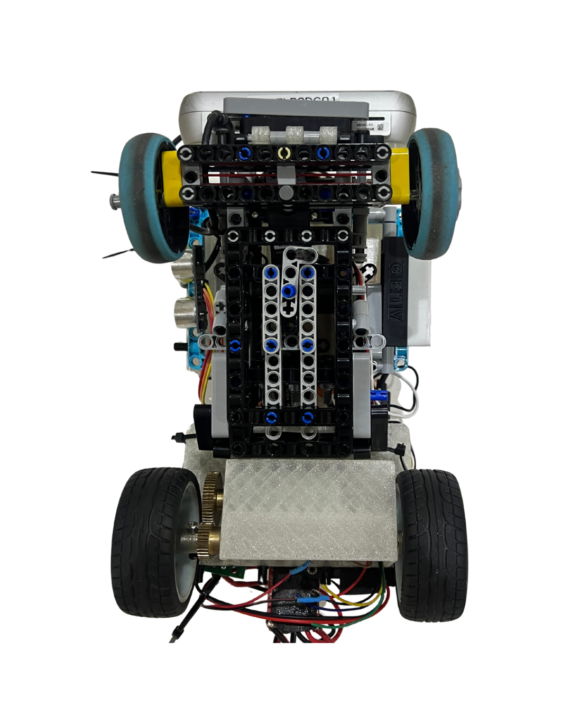 |
| :---: | :---: |
| **Top** | **Bottom** |

|  | 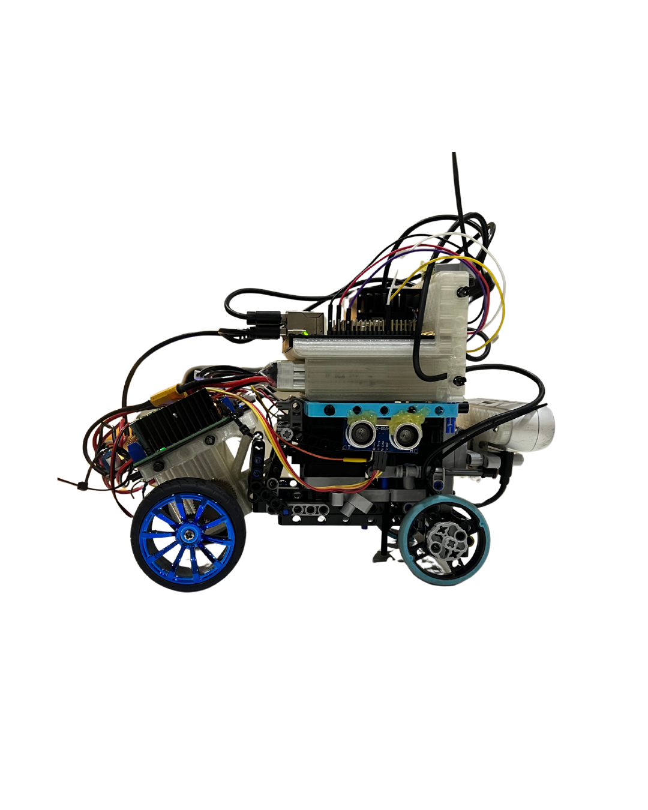 |
| :---: | :---: |
| **Left** | **Right** |

| 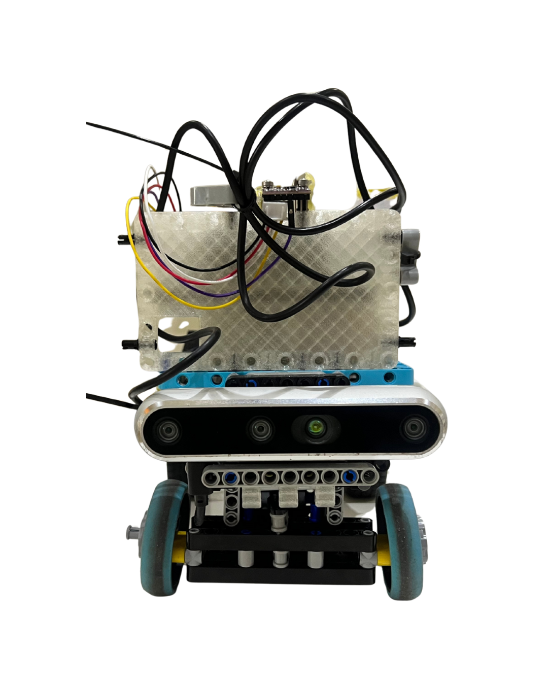 |  |
| :---: | :---: |
| **Front** | **Back** |
### Key specifications

| Specification | Final value |
| --- | --- |
| Length × width × height | [TODO] |
| Mass | 1.38 KG |
| Wheelbase / track width | [TODO] |
| Ground clearance | [TODO] |
| Drive layout | One motor, two gears, one drive shaft, two driven back wheels |
| Steering layout | LEGO-based parallel front steering system|
| Main computer | NVIDIA Jetson Orin Nano, Ubuntu 22.04 LTS |
| Microcontroller | ESP32 |
| Primary camera | Intel RealSense D455 |
| IMU | BNO055 breakout |
| Additional sensors | Two side ultrasonic sensors |
| Front wheels | LEGO SPIKE blue wheels, part `39367` |
| Back wheels | RC Car Tires Wheels |
| Batteries | Separate Jetson and motor/actuator batteries |

## Performance videos

| Challenge | Video | 
| --- | --- | 
| Open Challenge | [Watch on Youtube](https://youtu.be/7jsuhlpw6mA) | 
| Obstacle Challenge | [Watch on Youtube](https://youtu.be/TGH4JoCRx5o) | 


## How IriSight works

[TODO: System overview]

### System architecture

[TODO: System block diagram]

| Flow | Summary |
| --- | --- |
| Power | [TODO] |
| Perception | [TODO] |
| Decision | [TODO] |
| Actuation | [TODO] |
| Feedback and safety | [TODO] |

## Our engineering journey

[TODO: Development story]

| Version/date | Problem or goal | Change | Evidence | Result and next decision |
| --- | --- | --- | --- | --- |
| Concept | Ackermann steering | [TODO] | [TODO] | Parallel steering selected |
| Prototype 1 | [TODO] | [TODO] | [TODO] | [TODO] |
| Prototype 2 | [TODO] | [TODO] | [TODO] | [TODO] |
| Final | [TODO] | [TODO] | [TODO] | [TODO] |

## Mobility and mechanical design

### Chassis and component mounting

IriSight uses a LEGO-based chassis so the team can change the geometry and component positions without manufacturing an entirely new frame. The Jetson is protected by a custom 3D-printed enclosure designed to connect directly to LEGO parts. The final dimensions, mass, mounting coordinates, rigidity checks, and center-of-mass measurements will be added after the mechanical configuration is frozen.

[TODO: Dimensioned mechanical diagram]

### Rear drive system

One DC motor drives two rear wheels. Its output passes through a two-gear transmission to a drive shaft connecting the rear wheels. The motor and rear-wheel models are carried over from the previous vehicle, but their exact identifiers, gear tooth counts, ratio, mounting, and measured performance remain to be documented for the 2026 build.

### Parallel steering system

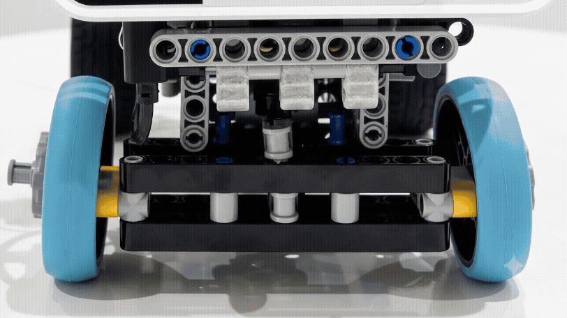

The two front LEGO SPIKE `39367` wheels are steered by a larger servo through a LEGO parallel linkage. Ackermann steering was the original plan, but a suitable LEGO mechanism could not be completed within the available development time. The parallel mechanism was selected for the current vehicle; the final documentation will compare its geometry, steering play, turning radius, build complexity, and tire scrub with the attempted Ackermann design.

### Torque and speed summary

| Result | Final value | Evidence |
| --- | ---: | --- |
| Gear ratio | [TODO] | [TODO] |
| Calculated no-load speed | [TODO] | [TODO] |
| Measured vehicle speed | [TODO] | [TODO] |
| Required wheel torque | [TODO] | [TODO] |
| Available wheel torque | [TODO] | [TODO] |
| Torque margin | [TODO] | [TODO] |
| Stopping distance | [TODO] | [TODO] |

### Mechanical iterations

[TODO: Best mechanical comparison image]

[TODO: Mechanical iteration summary]

**Detailed evidence:** [mechanical design, calculations, CAD, assembly, and validation](models/)

## Power and sensor architecture

### Power architecture

[TODO: Wiring and power-tree diagram]

The vehicle uses two battery domains: one battery supplies the Jetson and its logic/sensing system, while a second battery supplies the motor-driver side. A regulator provides the required stable voltage. Exact battery, regulator, motor-driver, connector, protection, and current ratings are still being identified and will be verified against measured typical and peak current.

| Power domain | Source | Loads | Typical current | Peak current | Runtime/margin |
| --- | --- | --- | ---: | ---: | --- |
| Jetson/logic | [TODO] | [TODO] | [TODO] | [TODO] | [TODO] |
| Motor/actuator | [TODO] | [TODO] | [TODO] | [TODO] | [TODO] |

### Component and interface map
### Jetson

| Component | Exact model | Interface | Purpose | Details |
| --- | --- | --- | --- | --- |
| <p align="center">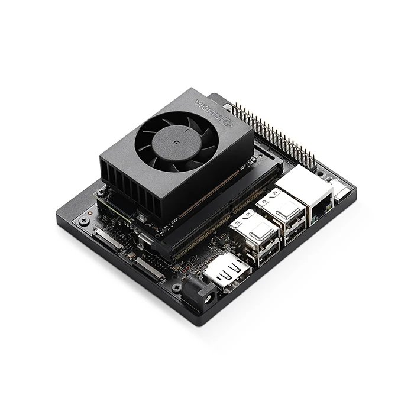</p> | NVIDIA Jetson Orin Nano | [TODO] | Main processing | [LINK](https://www.amazon.com/dp/B0BZJTQ5YP) |

### Custom ESP32 Board

| Component | Exact model | Interface | Purpose | Details |
| --- | --- | --- | --- | --- |
| <p align="center">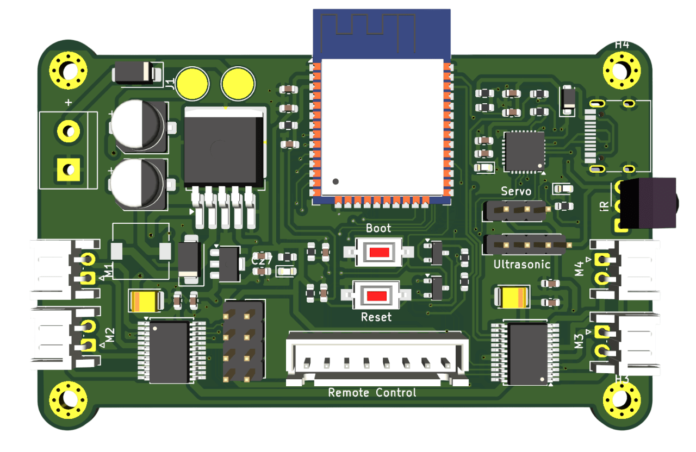</p> | ESP32 WROOM Chip | Serial | Actuator control | [LINK](https://www.amazon.com/DORHEA-ESP-WROOM-32D-Bluetooth-integrates-ESP32-D0WD/dp/B08XXH9RMT?th=1) |

### Motor Driver

| Component | Exact model | Interface | Purpose | Details |
| --- | --- | --- | --- | --- |
| <p align="center"></p> | TB6612FNG | [TODO] | Drive-motor control | [LINK](https://www.amazon.com/Sparkfun-PID-14451-Motor-Driver/dp/B01MF67DX6) |

### Steering Servo

| Component | Exact model | Interface | Purpose | Details |
| --- | --- | --- | --- | --- |
| <p align="center">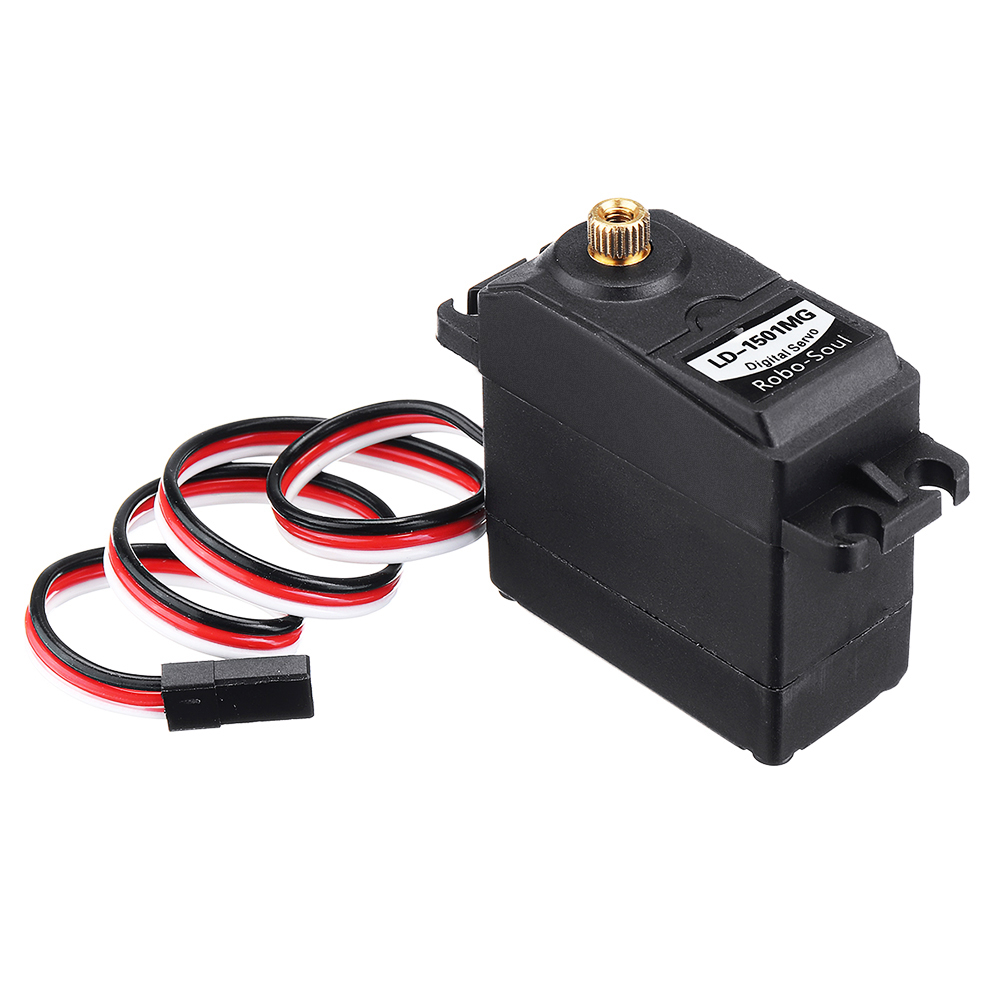</p> | LD-1501MG Servo | [TODO] | Front steering | [LINK](https://www.ebay.com/itm/362680017196) |

### D455

| Component | Exact model | Interface | Purpose | Details |
| --- | --- | --- | --- | --- |
| <p align="center">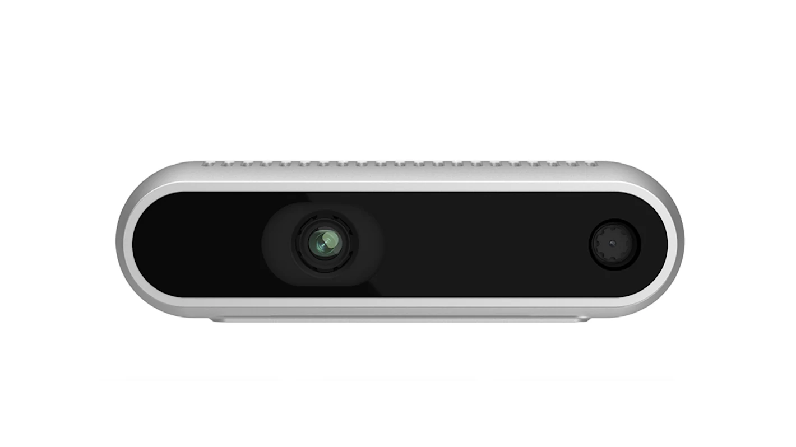</p> | Intel RealSense D455 | USB | Depth perception | [LINK](https://www.amazon.com/dp/B08KJCRCGG?) |

### IMU

| Component | Exact model | Interface | Purpose | Details |
| --- | --- | --- | --- | --- |
| <p align="center"></p> | BNO055 | I²C | Relative yaw | [LINK](https://bdelectronics.xyz/product/bno055-intelligent-9axis-attitude-sensor-module) |

### Left Ultrasonic

| Component | Exact model | Interface | Purpose | Details |
| --- | --- | --- | --- | --- |
| <p align="center"></p> | Generic HC-SR04 ultrasonic sensors | [TODO] | [TODO] | [LINK](https://www.amazon.com/MTDELE-HC-SR04-Ultrasonic-Mounting-Bracket/dp/B0G6ZDBTWR?) |

### Right Ultrasonic

| Component | Exact model | Interface | Purpose | Details |
| --- | --- | --- | --- | --- |
| <p align="center"></p> | Generic HC-SR04 ultrasonic sensors | [TODO] | [TODO] | [LINK](https://www.amazon.com/MTDELE-HC-SR04-Ultrasonic-Mounting-Bracket/dp/B0G6ZDBTWR?) |

### Jetson Battery

| Component | Exact model | Interface | Purpose | Details |
| --- | --- | --- | --- | --- |
| <p align="center">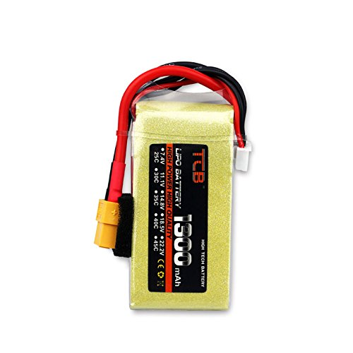</p> | TCB 1100mAh 3S 25C battery | — | Logic power | [LINK](https://rcdrone.top/products/tcb-2s-3s-4s-5s-6s-7s-8s-1100mah-25c-lipo-battery-with-xt60-plug-for-rc-planes-fpv-drones-helicopters-cars) |

### Motor Battery

| Component | Exact model | Interface | Purpose | Details |
| --- | --- | --- | --- | --- |
| <p align="center"></p> | TCB 1100mAh 3S 25C battery | — | Actuator power | [LINK](https://rcdrone.top/products/tcb-2s-3s-4s-5s-6s-7s-8s-1100mah-25c-lipo-battery-with-xt60-plug-for-rc-planes-fpv-drones-helicopters-cars) |

### Buck Converter

| Component | Exact model | Interface | Purpose | Details |
| --- | --- | --- | --- | --- |
| <p align="center"></p> | Buck converter at 5V | — | Actuator power | [LINK]() |

### Buck Boost Converter

| Component | Exact model | Interface | Purpose | Details |
| --- | --- | --- | --- | --- |
| <p align="center"></p> | Buck boost converter at 11V | — | Actuator power | [LINK]() |

### Regulator

| Component | Exact model | Interface | Purpose | Details |
| --- | --- | --- | --- | --- |
| <p align="center"></p> | [TODO] | — | Voltage regulation |  |
### Sensor placement and calibration

| Sensor | Placement | Selection reason | Calibration | Limitation and mitigation |
| --- | --- | --- | --- | --- |
| D455 | Mounted at the front/top of the robot, facing forward with a clear view of the track | Provides RGB and depth data for obstacle detection, pillar detection, wall following, and distance measurement | Mounted level and securely; depth readings are tested at known distances and filtered | Depth can be noisy on reflective, dark, or very close surfaces. ROI averaging/filtering and fallback control logic are used |
| BNO055 | Mounted on the upper section of the robot chassis, near the center and away from motors and power wiring as much as possible | Provides orientation and heading data for more stable navigation and turning | Calibrated according to the sensor's required motion/orientation procedure before operation | Magnetic interference and vibration can affect accuracy. The sensor is mounted securely, kept away from high-current components where possible, and readings are validated |
| Left ultrasonic | Mounted on the left side of the robot chassis, facing outward toward the left | Provides additional close-range obstacle and wall detection on the left side | Tested using objects at known distances; the detection threshold is adjusted based on test results | Can give inaccurate readings on angled, soft, or irregular surfaces. Used as an additional safety sensor with threshold-based filtering |
| Right ultrasonic | Mounted on the right side of the robot chassis, facing outward toward the right | Provides additional close-range obstacle and wall detection on the right side | Tested using objects at known distances; the detection threshold is adjusted based on test results | Can give inaccurate readings on angled, soft, or irregular surfaces. Used as an additional safety sensor with threshold-based filtering |

**Detailed evidence:** [electrical architecture, wiring, power budget, sensor placement, calibration, and safety](schemes/)

## Software and challenge strategy

### Architecture and communication

The current Open Challenge system runs on the Jetson. It reads the RealSense D455 and BNO055, calculates steering and speed, and sends `DRIVE <steerDeg> <speed>` commands to the ESP32 through a 115200-baud serial connection. The ESP32-side firmware that converts these commands into motor-driver and steering-servo signals still needs to be added to the repository.

| **Module** | **Responsibility** | **Inputs** | **Outputs** |
|---|---|---|---|
| [`src/clockWise.py`](https://github.com/WRO-2026-AUPP/WRO_IriSight/blob/main/src/clockWise.py) | Left-wall depth following with counter-clockwise yaw checkpoints | D455 depth/color, BNO055 yaw | ESP32 drive command, web diagnostics |
| [`src/counterClockWise.py`](https://github.com/WRO-2026-AUPP/WRO_IriSight/blob/main/src/counterClockWise.py) | Right-wall depth following with clockwise yaw checkpoints | D455 depth/color, BNO055 yaw | ESP32 drive command, web diagnostics |
| `src/bno055_yaw.py` | BNO055 yaw reading, calibration, and relative-heading tracking | BNO055, `bno055_calibration.json` | Relative yaw and calibration status |
| `bno055_calibration.json` | Stores the saved BNO055 calibration offsets used to restore sensor calibration | Saved calibration values | Calibration data for `bno055_yaw.py` |
| ESP32 firmware | Receives Jetson drive commands and controls the motors and steering servo | Jetson serial command | Motor-driver and servo control |

### Open Challenge

**Status:** Implemented for both directions.

Both programs align 640×480 depth and color frames at 30 FPS. They calculate the median of valid depth pixels inside front and side regions of interest, rejecting depths outside 0.15–4.00 m and requiring at least 50 valid pixels. On a straight, a PD controller maintains a 0.60 m side-wall target. If the side wall becomes unavailable, the program applies a small search steering command toward the missing wall.

When the median front distance reaches 0.60 m, the controller enters a fixed-steering corner state. It remains in that state until the front opens to 0.80 m, providing hysteresis so noise near one threshold does not repeatedly switch modes. Straight and corner speed commands are currently 200 and 180 on the program's 0–255 command scale. Steering is limited to ±35 degrees.

The BNO055 heading is zeroed at startup. Each program accepts the next expected 90-degree checkpoint within a ±10-degree zone, counts a lap only after all four checkpoints arrive in order, and stops after three laps plus a 0.5-second delay. A Flask diagnostic stream on port 5000 overlays the active mode, depth regions, steering, speed, yaw, lap count, and next checkpoint.

| Current control value | Value |
| --- | ---: |
| Side-wall target | 0.60 m |
| Front corner entry | 0.60 m |
| Front corner exit | 0.80 m |
| Proportional gain | 38.0 steering degrees/m |
| Derivative gain | 4.0 |
| Steering limit | ±35° |
| Straight/corner speed command | 200 / 180 |
| D455 stream | 640×480 at 30 FPS |
| Yaw checkpoint tolerance | ±10° |
| Required laps | 3 |

| Metric | Clockwise | Counter-clockwise | Test evidence |
| --- | ---: | ---: | --- |
| Trials | [TODO] | [TODO] | [TODO] |
| Successful three-lap runs | [TODO] | [TODO] | [TODO] |
| Success rate | [TODO] | [TODO] | [TODO] |
| Best/average completion time | [TODO] | [TODO] | [TODO] |
| Wall-distance error | [TODO] | [TODO] | [TODO] |

### Obstacle Challenge

**Status:** In development.

[TODO: Obstacle strategy, state machine, tuning, edge cases, and results]

**Detailed evidence:** [software architecture, algorithms, tuning, installation, configuration, and tests](src/)

## System integration, testing, and risk

### Subsystem interaction

For the current Open Challenge, the D455 depth and BNO055 yaw enter the Jetson control loop. Depth determines wall-distance steering and corner transitions, while yaw independently advances the heading checkpoints used for lap counting. The Jetson sends the resulting steering and speed command to the ESP32, which controls the drive and steering hardware. The final system documentation will add measured sensor-to-actuator latency, ESP32 timeout behavior, power-fault behavior, and validation results.

### Final regression results

| Test | Configuration/commit | Trials | Acceptance target | Result | Evidence |
| --- | --- | ---: | --- | --- | --- |
| Open clockwise | [TODO] | [TODO] | [TODO] | [TODO] | [TODO] |
| Open counter-clockwise | [TODO] | [TODO] | [TODO] | [TODO] | [TODO] |
| Obstacle Challenge | [TODO] | [TODO] | [TODO] | [TODO] | [TODO] |
| Parking | [TODO] | [TODO] | [TODO] | [TODO] | [TODO] |
| Runtime/power | [TODO] | [TODO] | [TODO] | [TODO] | [TODO] |
| Emergency/fault response | [TODO] | [TODO] | [TODO] | [TODO] | [TODO] |

### Key decisions

| Decision | Alternatives | Evidence | Trade-off |
| --- | --- | --- | --- |
| Parallel steering | Ackermann steering | [TODO] | [TODO] |
| LEGO chassis with printed Jetson enclosure | [TODO] | [TODO] | [TODO] |
| D455 depth wall following | [TODO] | [TODO] | [TODO] |
| Separate power sources | [TODO] | [TODO] | [TODO] |

### Risk register

| Risk/failure mode | Detection | Mitigation | Validation |
| --- | --- | --- | --- |
| Steering play or scrub | [TODO] | [TODO] | [TODO] |
| Loose LEGO/printed mounting | [TODO] | [TODO] | [TODO] |
| Missing or invalid depth | [TODO] | [TODO] | [TODO] |
| IMU drift/interference | [TODO] | [TODO] | [TODO] |
| Jetson–ESP32 communication loss | [TODO] | [TODO] | [TODO] |
| Power sag or actuator stall | [TODO] | [TODO] | [TODO] |

**Detailed evidence:** [Engineering Journal, raw and processed tests, decisions, risks, and final regression results](other/)

## Reproducing IriSight

### Required files and tools

[TODO: Requirements summary and links]

### Mechanical assembly

[TODO: Assembly summary and link]

### Wiring and power-on

[TODO: Wiring, validation, and first-power-on summary and link]


### Software Installation

The robot's control software runs on the NVIDIA Jetson Orin Nano. The required software and Python packages must be installed before running the vehicle.

#### 1. Clone the repository

```bash
git clone https://github.com/WRO-2026-AUPP/WRO_IriSight.git
```

#### 2. Navigate to the project directory

```bash
cd WRO_IriSight
```

#### 3. Install the required Python packages 

The following packages are required for numerical processing, computer vision, RealSense D455 depth sensing, YOLOv8 object detection, and Jetson-to-ESP32 serial communication.

```bash
pip install numpy
```
```bash
pip install opencv-python
```
```bash
pip install pyrealsense2
```
```bash
pip install ultralytics
```
```bash
pip install pyserial
```
#### 4. Verify the installation

```bash
python3 -c "import cv2, numpy, pyrealsense2, ultralytics, serial; print('All required packages installed successfully.')"
```

### Calibration

Before starting an autonomous run, calibrate the BNO055 and ensure that the saved calibration data is available.

#### Check the calibration file

The saved BNO055 calibration values are stored in:

```text
bno055_calibration.json
```

### Start an Autonomous Run

Select the appropriate control program based on the competition challenge and driving direction. Ensure that the Jetson Orin Nano, D455, BNO055, and ESP32 are connected and ready before starting the autonomous run.

#### 1. Open Challenge — Clockwise

```bash
python3 src/clockWise.py
```

#### 2. Open Challenge — Counter Clockwise

```bash
python3 src/counterClockWise.py
```

#### 3. Obstacle Avoidance Challenge — Clockwise

```bash
python3 src/obs_clockWise.py
```

#### 4. Obstacle Avoidance Challenge — Counter Clockwise

```bash
python3 src/obs_counterclockWise.py
```

### Pre-flight and acceptance test

[TODO: Pre-flight and acceptance-test summary]

## Current limitations and next improvements

| Limitation | Current effect | Planned improvement | Validation target |
| --- | --- | --- | --- |
| Depth sensing limitations | The RealSense D455 does not provide complete visibility from every position and angle. Some areas of the track or obstacles may fall outside the camera's effective field of view or produce unreliable depth measurements. | Improve camera placement and ROI selection, and combine depth sensing with ultrasonic measurements where appropriate. | Maintain reliable wall and obstacle distance measurements throughout the track. |
| Vision sensitivity | YOLOv8 detection performance can be affected by lighting, shadows, reflections, and changes in object appearance. | Expand and improve the training dataset and tune the detection model and confidence thresholds. | Reliably detect the required colored obstacles and parking signal under different lighting conditions. |
| Reaction distance | Obstacles detected too close to the robot may not leave enough distance for safe avoidance. | Improve detection range and trigger avoidance earlier using depth and vision information. | Consistently avoid obstacles without collision during repeated test runs. |
| BNO055 calibration | Accurate yaw-based navigation depends on proper sensor calibration and saved calibration data. | Improve the calibration procedure and maintain reliable saved calibration values. | Achieve consistent yaw readings and checkpoint detection across repeated runs. |
| Heading error | BNO055 yaw measurements may contain small errors or drift, which can affect turn timing and checkpoint detection. | Add heading correction and further tune yaw-based turning thresholds. | Keep heading error within the required navigation tolerance. |
| Controller tuning | Wall-following and obstacle-avoidance performance depends on manually tuned steering gains, target distances, and detection thresholds. | Further tune PD control parameters and navigation thresholds through track testing. | Achieve stable wall following and repeatable obstacle avoidance across multiple runs. |
| Processing load | Running YOLO inference, depth processing, and navigation simultaneously can increase Jetson CPU/GPU usage and introduce latency. | Optimize image/depth processing and reduce unnecessary computation. | Maintain real-time control without noticeable processing delays. |
| Serial communication | The robot depends on reliable communication between the Jetson and ESP32 for timely motor and steering commands. | Improve serial communication handling and add robust error handling. | Maintain reliable command transmission throughout a complete run. |
| Ultrasonic sensing | Ultrasonic readings can be affected by obstacle angle, surface characteristics, interference, and sensor placement. | Improve sensor placement and combine ultrasonic readings with depth information. | Obtain stable distance readings for close-range obstacle detection. |
| Steering geometry | The current prototype uses parallel steering, which can reduce turning accuracy and stability during sharp turns. | Replace the current mechanism with Ackermann steering. | Achieve more accurate and stable cornering with reduced path deviation. |
| Wheel friction | Differences in friction between the wheels and track surface can cause the robot to deviate from its intended path. Changes in surface conditions can also affect turning, acceleration, and stopping performance. | Improve wheel alignment, weight distribution, and mechanical design, and tune control parameters for different track conditions. | Reduce path deviation and achieve consistent movement across repeated runs. |

## Repository structure

| Path | Contents |
| --- | --- |
| [`src/`](src/) | Control software, firmware, configuration, and software documentation |
| [`schemes/`](schemes/) | Wiring, power, sensor-placement, and system diagrams |
| [`models/`](models/) | Mechanical documentation, CAD, and printable files |
| [`other/`](other/) | Engineering Journal, tests, calibration, risks, and decision records |
| [`v-photos/`](v-photos/) | Front, back, left, right, top, and bottom vehicle photographs |
| [`t-photos/`](t-photos/) | Official and informal team photographs |
| [`video/`](video/) | Challenge and project video links |

## Acknowledgements

[TODO]
