# 🧩 3D Models & Mechanical Components

This directory contains the CAD design files for IriSight's 3D-printed structural components — the parts that hold the electronics and mechanics onto the LEGO-based chassis. Each design is provided as a `.png` render (for quick viewing), a `.stl` (for slicing/printing), and a `.step` (for editing in CAD software).

This is also where our hardware journey actually started. Before any wiring or code, we needed a way to physically mount components onto the chassis — so the first thing we designed was a combined **Jetson + Battery container**. As more structural parts are designed, they are documented here as their own component, following the same format.

---

## 📂 File structure

```
models/
├── png/                          # Quick-view renders
├── STL_file/                     # Print-ready meshes
└── STEP_file/                    # Editable CAD source
```

---

## 📑 Table of Contents

This document currently covers all of our 3D-printed structural parts:

| # | Component | Status |
| --- | --- | --- |
| 1 | [Jetson & Battery Container](#component-1) | Finalized (V3) |
| 2 | [Rear Motor Mount](#component-2) | Finalized (V4) |
| 3 | [RealSense Camera Mount](#component-3) | Finalized (V2) |
| 4 | [Print Settings](#print-settings) | Finalized (V1) |

---

<a id="component-1"></a>

# 🖥️ Component 1 — Jetson & Battery Container

**Status:** Final design complete (V3)

## 📅 Design timeline

| Date | Milestone | What we did | What we learned | Next step |
| --- | --- | --- | --- | --- |
| 2026-May-27 | **V1 — Concept design** | Rough-drew the first version of a combined Jetson + battery mounting container in CAD, sized from measured/estimated component dimensions. | First pass at a shape that could hold both units without a full assembly test yet. | Print a small section to verify the measurements before committing to a full print. |
| 2026-May-27 | **P1 — Prototype test cut** | Instead of printing the entire V1 model, we cut out and printed just a small section of it to cheaply test whether the measured unit dimensions actually matched the real Jetson and battery. | The test piece came back with a small dimensional error — the fit was close, but not exact. **[TODO: quantify the error, e.g. "compartment was ~Xmm too narrow"]** | Adjust the V1 dimensions based on the P1 measurement error and prepare a corrected version. |
| 2026-June-02 | **V2 — LEGO-compatible redesign** | Redesigned the container to fit and connect with LEGO parts directly, inspired by the LEGO Beam Frame geometry. Added a row of LEGO-pin-spaced holes along the base/side so the container pins straight onto the LEGO chassis. | Since the rest of the chassis is LEGO-based, giving the printed part the same pin connection system makes it mount and reposition like any other LEGO piece — no separate brackets or screws needed. | **[TODO: next step — test-fit V2 pins into the actual LEGO chassis and record the result]** |
| 2026-June-03 | **V3 — Final design** | Refined V2 into the final version: rounded/filleted the exposed corners and edges, and added extra LEGO-pin holes on the front face for a more rigid mount. | Rounded edges reduce sharp corners that are more prone to print defects and snagging, and the extra pin holes give the container more mounting points on the chassis. | Container design is finalized (V3). Move on to designing the rear motor mount. |

> We test-print small sections before committing to a full-size print specifically to catch dimensional errors early without wasting filament/time on a full-size reprint. This is why P1 exists as a separate, smaller file rather than a full print of V1.

## 🖼️ V1 — Initial Design

<div align="center">
  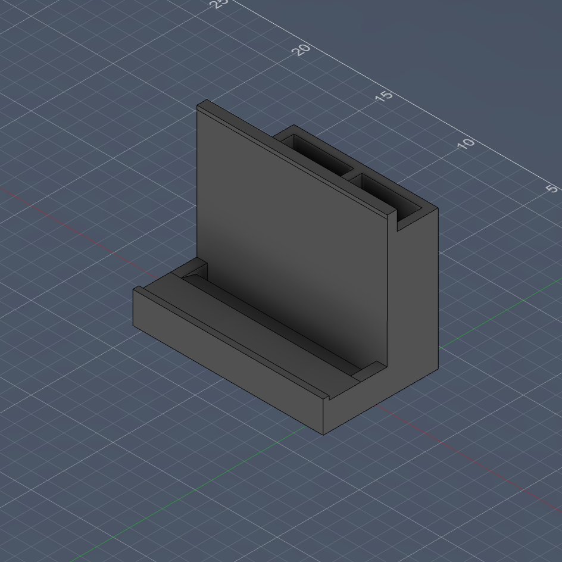
  <p><em>V1 — combined Jetson + battery container, first CAD draft (2026-May-27)</em></p>
</div>

The V1 design is an L-shaped container with two rectangular compartments sized to hold the Jetson and its battery side by side, with a base flange for mounting to the LEGO chassis.

**Files**

| Format | Link |
| --- | --- |
| PNG | [`JetsonAndBatteryV1.png`](./png/JetsonAndBatteryV1.png) |
| STL | [`JetsonAndBatteryV1.stl`](./STL_file/JetsonAndBatteryV1.stl) |
| STEP | [`JetsonAndBatteryV1.step`](./STEP_file/JetsonAndBatteryV1.step) |

## 🖼️ P1 — Prototype Test Cut

<div align="center">
  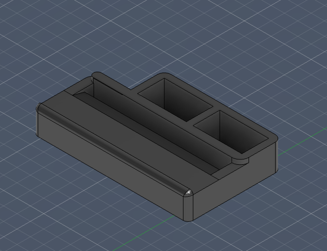
  <p><em>P1 — a small cut-out section of V1, printed to test-fit real components (2026-May-27)</em></p>
</div>

P1 is not a separate design — it's a small slice of the V1 geometry (one corner/compartment section), printed on its own to cheaply verify that the compartment dimensions matched the real Jetson and battery before committing to printing the full V1 shape.

**Files**

| Format | Link |
| --- | --- |
| PNG | [`JetsonAndBatteryP1.png`](./png/JetsonAndBatteryP1.png) |
| STL | [`JetsonAndBatteryP1.stl`](./STL_file/JetsonAndBatteryP1.stl) |
| STEP | [`JetsonAndBatteryP1.step`](./STEP_file/JetsonAndBatteryP1.step) |

## 🖼️ V2 — LEGO-Compatible Redesign

<div align="center">
  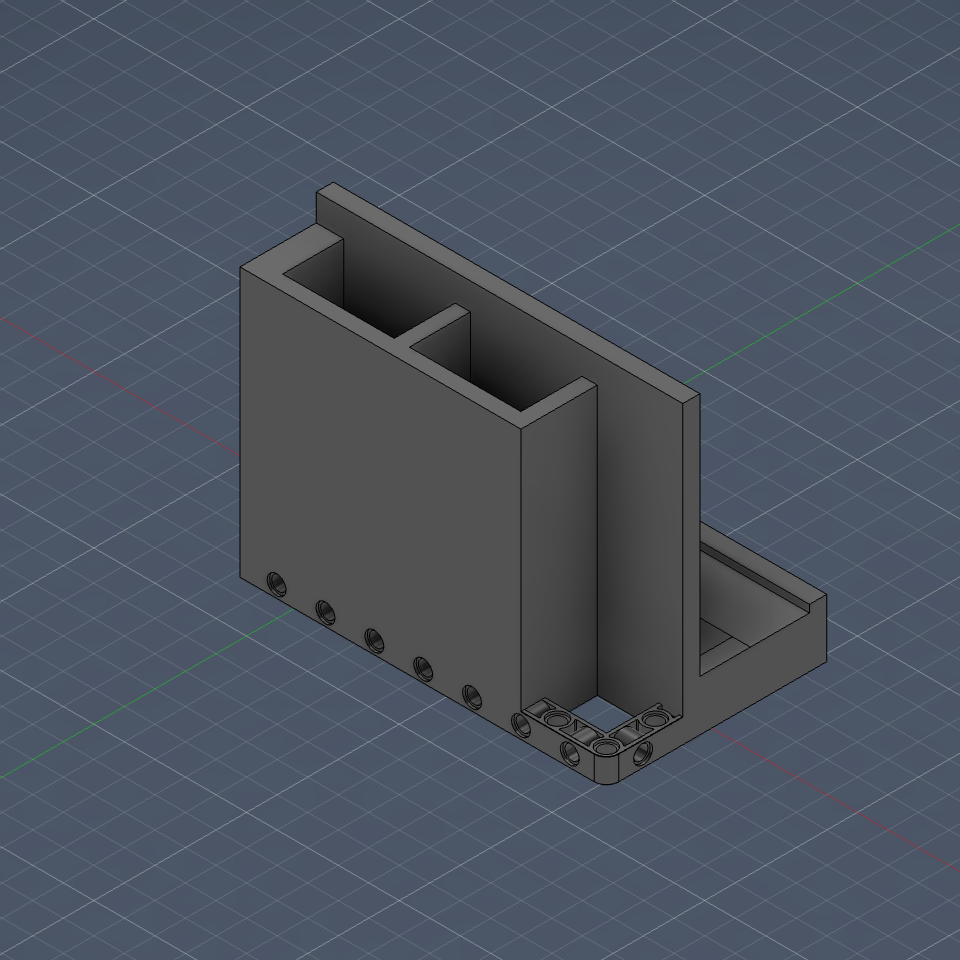
  <p><em>V2 — same two-compartment Jetson + battery layout as V1, redesigned with LEGO-pin-spaced holes for direct chassis mounting (2026-June-02)</em></p>
</div>

V2 keeps the V1 layout (two compartments for the Jetson and battery) but reworks the mounting method. We are building the rest of the chassis out of LEGO parts, so rather than mounting the printed container with separate brackets or screws, we redesigned it to fit and connect with LEGO parts directly — adding a row of holes spaced and sized to match a standard LEGO Technic beam, so the container can be pinned straight onto the chassis. The idea came directly from studying the LEGO Beam Frame geometry below.

**Files**

| Format | Link |
| --- | --- |
| PNG | [`JetsonAndBatteryV2.png`](./png/JetsonAndBatteryV2.png) |
| STL | [`JetsonAndBatteryV2.stl`](./STL_file/JetsonAndBatteryV2.stl) |
| STEP | [`JetsonAndBatteryV2.step`](./STEP_file/JetsonAndBatteryV2.step) |

## 🖼️ V3 — Final Design

<div align="center">
  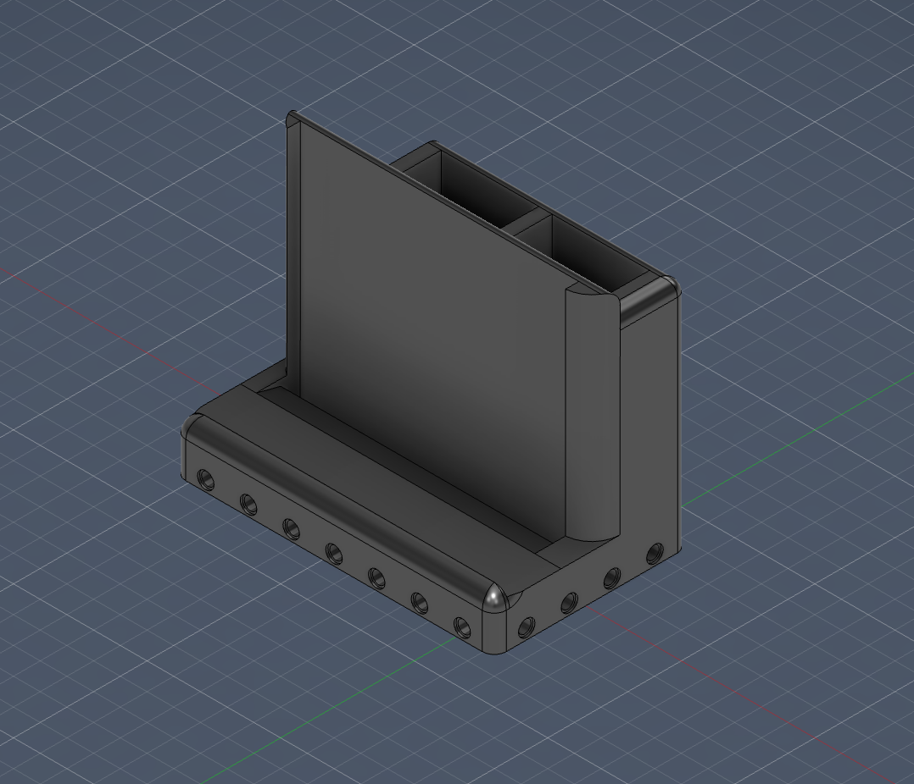
  <p><em>V3 — final revision: rounded corners/edges and extra LEGO-pin holes for a more rigid mount (2026-June-03)</em></p>
</div>

V3 is the final version of the Jetson + battery container. It keeps V2's two-compartment layout and LEGO-pin mounting, and refines it: exposed corners and edges are rounded/filleted, and extra LEGO-pin holes were added to the front face for a more rigid mount to the chassis. Rounding the edges also makes the part cleaner to 3D print and less likely to chip or snag against other parts.

**Files**

| Format | Link |
| --- | --- |
| PNG | [`JetsonAndBatteryV3.png`](./png/JetsonAndBatteryV3.png) |
| STL | [`JetsonAndBatteryV3.stl`](./STL_file/JetsonAndBatteryV3.stl) |
| STEP | [`JetsonAndBatteryV3.step`](./STEP_file/JetsonAndBatteryV3.step) |

### 📐 Final Engineering Blueprint

<div align="center">
  
  <p><em>Final blueprint sheet — top, right-side, front, and isometric views with full dimensions and material properties</em></p>
</div>

This blueprint is the final technical reference for the container: orthographic top/side/front views with dimensions in millimeters, plus an isometric view, generated directly from the final V3 CAD model with the correct print material assigned.

| Property | Value |
| --- | --- |
| Material | PLA (3D print), density 1.24 g/cm³ |
| Volume | 222.051 cm³ |
| Mass (at 100% infill) | 275.3 g |
| Bounding box (L × W × H) | 120.0 × 72.2 × 96.9 mm |
| Surface area | 737.111 cm² |

## 🖼️ Reference — LEGO Beam Frame

<div align="center">
  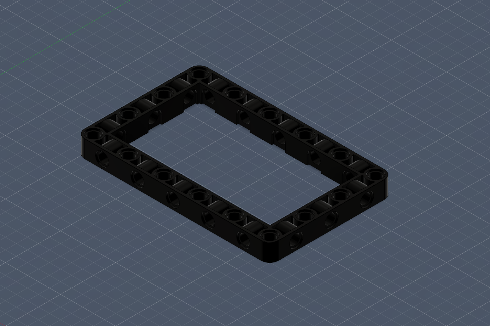
  <p><em>LEGO Beam Frame — reference geometry used to match V2/V3's hole spacing and size to standard LEGO Technic pins</em></p>
</div>

This is a CAD model of a standard LEGO Technic beam frame, modeled as a reference so the container's mounting holes could be designed to the same pin spacing and diameter as real LEGO parts — this is what makes V2/V3 a drop-in fit on the LEGO chassis instead of just a visually similar hole pattern.

**Files**

| Format | Link |
| --- | --- |
| PNG | [`LegoBeamFrame.png`](./png/LegoBeamFrame.png) |
| STL | [`LegoBeamFrame.stl`](./STL_file/LegoBeamFrame.stl) |
| STEP | [`LegoBeamFrame.step`](./STEP_file/LegoBeamFrame.step) |

---

<a id="component-2"></a>

# ⚙️ Component 2 — Rear Motor Mount

**Status:** Final design complete (V4)

This section documents the CAD design of the mount that holds the rear DC gear-motor to the chassis. It went through four iterations: a basic block-shaped mount, a LEGO-connectable redesign that failed a physical fit test, a corrected version, and a final version that also carries the rear electronics.

## 📅 Design timeline

| Date | Milestone | What we did | What we learned | Next step |
| --- | --- | --- | --- | --- |
| 2026-May-26 | **V1 — Basic block mount** | Drew the first, very basic version: a solid block with a U-shaped cradle for the motor body and a hole pattern to bolt the motor to it. No LEGO connection yet. | Established the core motor cradle shape before worrying about how it attaches to the chassis. | Add a way to connect the mount to the LEGO chassis. |
| 2026-May-29 | **V2 — LEGO-connectable redesign** | Redesigned V1 with two LEGO Technic beam arms sticking straight up on a **vertical axis**, inspired by the `LegoAngleBeam` reference part, so the mount could pin directly onto the LEGO chassis like the Jetson/battery container does. | We printed and test-fit V2 on the actual robot. It was **completely wrong** — with the vertical-axis arms, the mount ended up misaligned with the front wheel/steering assembly, which affected the robot's turning. | Reorient the LEGO connection arms so the mount no longer conflicts with the front wheel/steering geometry. |
| 2026-June-12 | **V3 — Corrected orientation** | Changed the LEGO-connecting arms from a vertical axis to an angled orientation, both to fix the front-wheel misalignment found in V2 and to make the arms easier to mount in general. | Reorienting the connection geometry (not just resizing it) was what actually fixed the misalignment — a purely dimensional fix would not have solved a directional/alignment problem. | Confirm the fix, then add a place to mount the rear electronics. |
| 2026-June-14 | **V4 — Final design** | Final version: reworked the LEGO mounting again for a better connection, and added a flat top plate as a mounting shelf for rear electronics (ESP32 board, buck converter, etc.), with some extra workaround geometry to make everything fit together. | Combining the motor mount with the electronics shelf needed some non-obvious workarounds to make both fit without interfering with each other, but it worked out. | Design finalized (V4). Test-fit the electronics on the plate and confirm clearances. |

> V2 is a good example of why we physically print and test-fit every mechanical iteration instead of trusting the CAD render alone: the misalignment with the front wheel was only obvious once the part was mounted on the real robot, not in the CAD viewport.

## 🖼️ V1 — Basic Block Mount

<div align="center">
  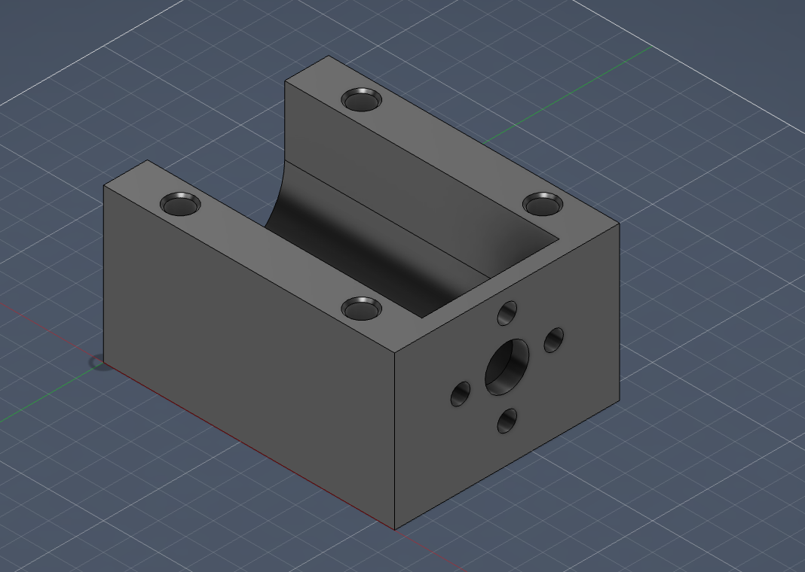
  <p><em>V1 — basic block motor cradle with bolt pattern, no LEGO connection yet (2026-May-26)</em></p>
</div>

The first version is a simple solid block with a curved U-channel cradle that the motor body sits in, plus a circular bolt/shaft hole pattern on the front face. This established the core motor-holding shape before any chassis-connection method was designed.

**Files**

| Format | Link |
| --- | --- |
| PNG | [`MotorMountV1.png`](./png/MotorMountV1.png) |
| STL | [`MotorMountV1.stl`](./STL_file/MotorMountV1.stl) |
| STEP | [`MotorMountV1.step`](./STEP_file/MotorMountV1.step) |

## 🖼️ V2 — LEGO-Connectable Redesign (failed fit test)

<div align="center">
  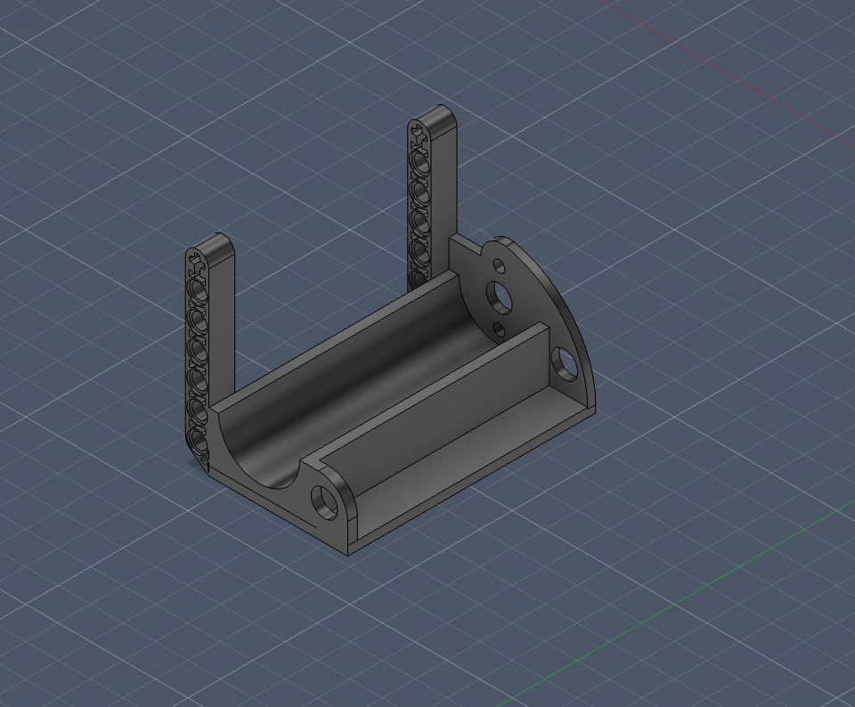
  <p><em>V2 — two vertical-axis LEGO Technic arms added, inspired by the LEGO Angle Beam (2026-May-29)</em></p>
</div>

V2 keeps the V1 motor cradle but adds two LEGO Technic beam arms standing straight up on a vertical axis, so the mount could pin directly onto the LEGO chassis — the same idea used for the Jetson & Battery Container, inspired by studying a LEGO angle beam (see the reference part below).

**This version failed its physical test.** Once printed and assembled onto the real robot, the vertical-axis arms put the mount out of alignment with the front wheel/steering assembly, which affected the robot's turning. This is what drove the orientation change in V3.

**Files**

| Format | Link |
| --- | --- |
| PNG | [`MotorMountV2.png`](./png/MotorMountV2.png) |
| STL | [`MotorMountV2.stl`](./STL_file/MotorMountV2.stl) |
| STEP | [`MotorMountV2.step`](./STEP_file/MotorMountV2.step) |

## 🖼️ V3 — Corrected Orientation

<div align="center">
  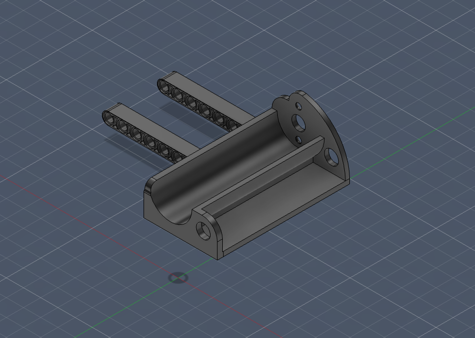
  <p><em>V3 — LEGO arms reoriented away from the vertical axis, fixing the V2 front-wheel misalignment (2026-June-12)</em></p>
</div>

V3 changes the orientation of the LEGO connection arms away from the vertical axis used in V2. This fixed the front-wheel/steering misalignment found when V2 was test-fit on the robot, and also made the arms easier to mount in general.

**Files**

| Format | Link |
| --- | --- |
| PNG | [`MotorMountV3.png`](./png/MotorMountV3.png) |
| STL | [`MotorMountV3.stl`](./STL_file/MotorMountV3.stl) |
| STEP | [`MotorMountV3.step`](./STEP_file/MotorMountV3.step) |

## 🖼️ V4 — Final Design

<div align="center">
  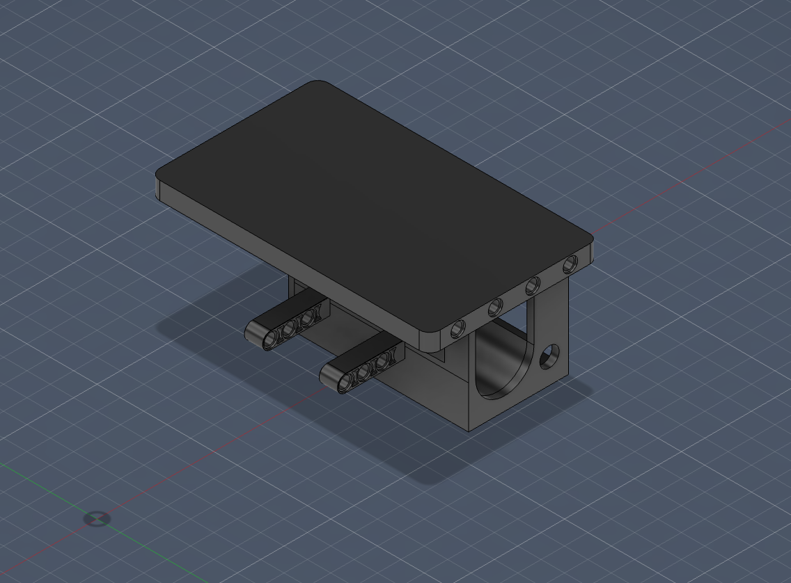
  <p><em>V4 — final version: reworked LEGO mounting plus a flat top plate to carry the rear electronics (2026-June-14)</em></p>
</div>

V4 is the final motor mount design. It reworks the LEGO connection once more for a better mount, and adds a flat plate on top to serve as a mounting shelf for the rear electronics — the ESP32 board, buck converter, and similar components — with some extra workaround geometry added to make the motor cradle, LEGO mounting, and electronics shelf all fit together on one part. This was the version selected for the final robot.

**Files**

| Format | Link |
| --- | --- |
| PNG | [`MotorMountV4.png`](./png/MotorMountV4.png) |
| STL | [`MotorMountV4.stl`](./STL_file/MotorMountV4.stl) |
| STEP | [`MotorMountV4.step`](./STEP_file/MotorMountV4.step) |

### 📐 Final Engineering Blueprint

<div align="center">
  
  <p><em>Final blueprint sheet — top, right-side, front, and isometric views with full dimensions and material properties</em></p>
</div>

| Property | Value |
| --- | --- |
| Material | PLA (3D print), density 1.24 g/cm³ |
| Volume | 113.346 cm³ |
| Mass (at 100% infill) | 140.5 g |
| Bounding box (L × W × H) | 72.2 × 120.0 × 56.7 mm |
| Surface area | 502.699 cm² |

## 🖼️ Reference — LEGO Angle Beam

<div align="center">
  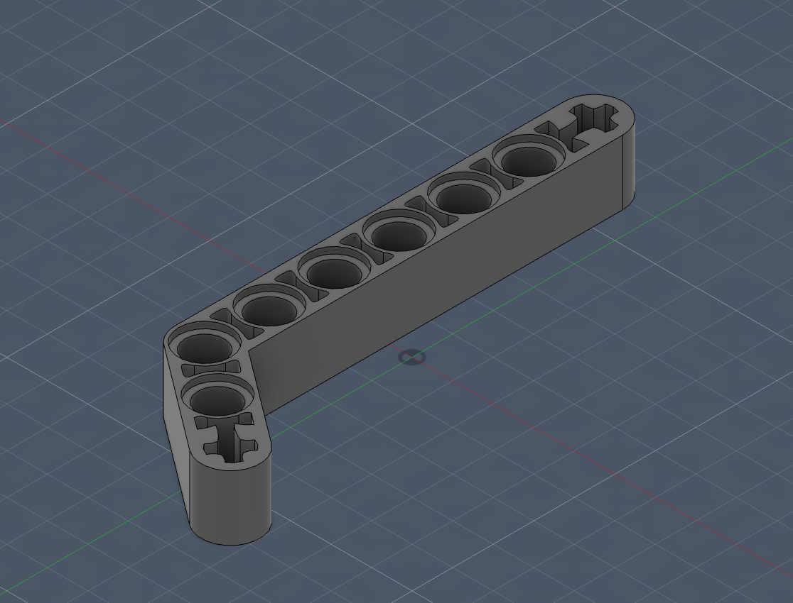
  <p><em>LEGO Angle Beam — reference geometry that inspired the LEGO-connectable arms on V2–V4</em></p>
</div>

This is a CAD model of a standard LEGO Technic angle beam, modeled as a reference for the LEGO-pin spacing and hole sizing used on the motor mount's connection arms from V2 onward.

**Files**

| Format | Link |
| --- | --- |
| PNG | [`LegoAngleBeam.png`](./png/LegoAngleBeam.png) |
| STL | [`LegoAngleBeam.stl`](./STL_file/LegoAngleBeam.stl) |
| STEP | [`LegoAngleBeam.step`](./STEP_file/LegoAngleBeam.step) |

---

<a id="component-3"></a>

# 📷 Component 3 — RealSense Camera Mount

**Status:** Final design complete (V2)

This section documents the mount that holds the Intel RealSense D455 to the chassis via three LEGO Technic pin arms. It only took two iterations — the second was a small but important change to how the mount connects to the LEGO chassis, found by printing and test-fitting both versions.

## 📅 Design timeline

| Date | Milestone | What we did | What we learned | Next step |
| --- | --- | --- | --- | --- |
| 2026-June-05 | **V1 — Same-direction mounting holes** | Designed a mount with three LEGO Technic pin arms hanging below the camera bar, with each arm's pin holes facing the **same direction the RealSense camera faces**. | — | Print and test-fit alongside a second orientation. |
| 2026-June-09 | **V2 — Facing mounting holes** | Rotated the pin holes on the three arms so they **face each other** (inward) instead of facing the same direction as the camera. | We printed and physically tested both V1 and V2. V2 was easier to mount onto the LEGO chassis and made a more robust connection than V1. | Design finalized (V2), selected for the final robot. |

> The only geometric difference between V1 and V2 is the direction the LEGO pin holes face on the three mounting arms — everything else (camera bar, hole spacing, arm count) is identical. This isolates the comparison to a single variable, which is why we can be confident the mounting-hole orientation is what made V2 more robust, not some other change.

## 🖼️ V1 — Same-Direction Mounting Holes

<div align="center">
  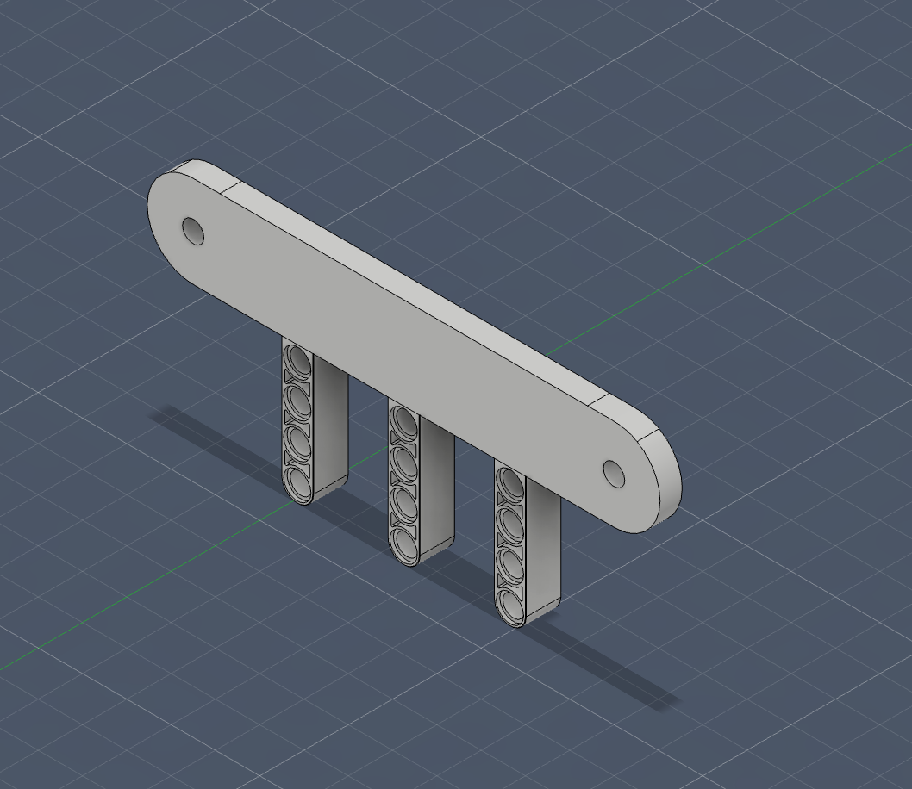
  <p><em>V1 — three LEGO pin arms with holes facing the same direction as the camera (2026-June-05)</em></p>
</div>

A long bar with two mounting holes for the RealSense D455 itself, supported by three LEGO Technic pin arms hanging below it. In V1, each arm's pin holes face the same direction the camera faces.

**Files**

| Format | Link |
| --- | --- |
| PNG | [`RealSenseV1.png`](./png/RealSenseV1.png) |
| STL | [`RealSenseV1.stl`](./STL_file/RealSenseV1.stl) |
| STEP | [`RealSenseV1.step`](./STEP_file/RealSenseV1.step) |

## 🖼️ V2 — Final Design (Facing Mounting Holes)

<div align="center">
  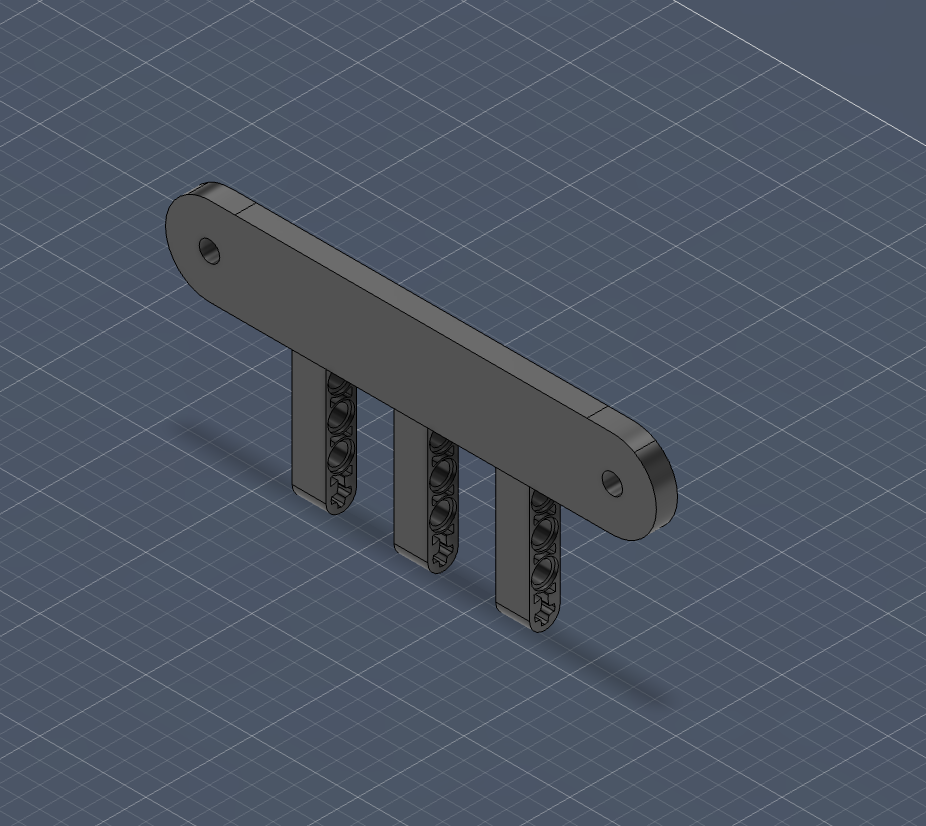
  <p><em>V2 — final design: pin holes on the three arms rotated to face each other (2026-June-09)</em></p>
</div>

Same camera bar and three-arm layout as V1, but the pin holes on the arms are rotated to face each other instead of facing the same direction as the camera. Testing both printed versions on the robot showed this orientation mounts more easily onto the LEGO chassis and holds more robustly, so V2 was selected as the final design.

**Files**

| Format | Link |
| --- | --- |
| PNG | [`RealSenseV2.png`](./png/RealSenseV2.png) |
| STL | [`RealSenseV2.stl`](./STL_file/RealSenseV2.stl) |
| STEP | [`RealSenseV2.step`](./STEP_file/RealSenseV2.step) |

### 📐 Final Engineering Blueprint

<div align="center">
  
  <p><em>Final blueprint sheet — top, right-side, front, and isometric views with full dimensions and material properties</em></p>
</div>

| Property | Value |
| --- | --- |
| Material | PLA (3D print), density 1.24 g/cm³ |
| Volume | 14.799 cm³ |
| Mass (at 100% infill) | 18.4 g |
| Bounding box (L × W × H) | 115.7 × 7.2 × 51.9 mm |
| Surface area | 108.56 cm² |

---

<a id="print-settings"></a>

## 🖨️ Print Settings

All three components above (Jetson & Battery Container, Rear Motor Mount, RealSense Camera Mount) are printed with the same settings:

| Setting | Value |
| --- | --- |
| Material | PLA |
| Layer height | 0.2 mm (standard quality) |
| Infill | 20–30% for structural components |
| Support | Required for overhangs greater than 60° |

> These are the settings we actually print with, which is also why each blueprint's mass value (computed at 100% infill) is an upper bound rather than the real printed mass — the real, 20–30%-infill parts weigh less.

