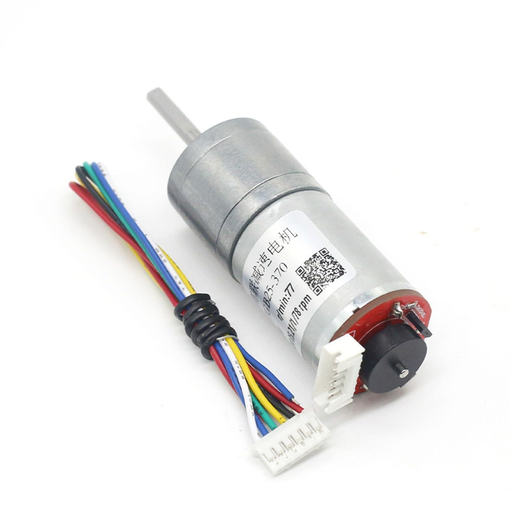

# Electromechanical Diagrams

This directory contains one or several schematic diagrams in JPEG, PNG, or PDF format showing the electromechanical architecture of the vehicle. The diagrams illustrate all electronic components, sensors, motors, power sources, and communication connections used in the vehicle.

The vehicle is built around a **Jetson Nano + ESP32 architecture**. The Jetson Nano handles high-level processing, computer vision, sensor interpretation, and decision-making, while the ESP32 handles low-level hardware control such as motor control, steering, and ultrasonic sensors.

The main electrical components are:

* Custom ESP32 development board
* Jetson Nano
* Intel RealSense D455
* Geared DC motors with encoders
* Generic HC-SR04 ultrasonic sensors
* LD-1501MG servo
* BNO055 IMU

The power system consists of:

* 2 × TCB 1100mAh 3S 25C batteries
* XL4015 5V buck converter
* XL4016 11V buck-boost converter

# Main Components

## Custom ESP32 Development Board

The custom ESP32 development board is responsible for low-level control of the vehicle. It acts as the interface between the Jetson Nano and the physical actuators and sensors.

The Jetson Nano sends movement commands to the ESP32 through a USB serial connection. The ESP32 receives these commands and converts them into appropriate motor, steering, and other hardware actions.

The board contains **four motor sockets**, allowing up to four DC motors to be connected. The pin configuration below corresponds to **M1**.

### Motor Driver

The board uses **TB6612 H-bridge motor drivers** to control the geared DC motors.

The H-bridge allows the ESP32 to control both the direction and speed of the motors. Motor speed is controlled using PWM, while the two direction pins determine whether the motor rotates forward or backward.

For motor M1, the pin configuration is:

| Function | ESP32 Pin |
| -------- | --------: |
| IN1      |        26 |
| IN2      |        25 |
| PWM      |        33 |

* **IN1 and IN2** control the motor direction.
* **PWM** controls the motor speed.
* The TB6612 provides the required current handling for the motors rather than having the ESP32 drive the motors directly.

> [!NOTE]
> The board features four motor sockets for DC motors. The pin definition above is for **M1**.

### Steering Servo

The steering system is controlled using the **LD-1501MG servo**.

The servo signal is connected to:

* **Signal:** GPIO 17

The ESP32 generates the PWM control signal required to position the servo. The Jetson Nano determines the desired steering direction and sends the corresponding command to the ESP32.

### Ultrasonic Sensor

The custom ESP32 board also provides connections for the HC-SR04 ultrasonic sensors.

The current pin configuration is:

| Function | ESP32 Pin |
| -------- | --------: |
| Trigger  |        13 |
| Echo     |        39 |

The ESP32 triggers the ultrasonic sensor and measures the returned echo signal to determine the distance to nearby objects.

The measured distance can then be transmitted back to the Jetson Nano through the USB/UART communication link.

---

## Jetson Nano

The **Jetson Nano** acts as the main computing and decision-making unit of the vehicle.

It is responsible for:

* Image processing
* Object detection
* Depth processing
* Navigation
* Sensor interpretation
* Generating movement commands for the ESP32

The ESP32 mainly acts as a low-level controller. It receives commands from the Jetson Nano and executes them using the connected motors, servo, and sensors.

### Communication with ESP32

The Jetson Nano communicates with the ESP32 through a **USB cable**.

The custom ESP32 board contains a **CP2101 USB-to-UART converter**. This converter translates the USB communication from the Jetson Nano into UART serial communication that can be processed by the ESP32.

The communication process is:

1. The Jetson Nano processes camera and sensor information.
2. The navigation algorithm determines the desired movement.
3. The Jetson Nano sends a command through USB.
4. The CP2101 converts the USB communication into UART.
5. The ESP32 receives and interprets the command.
6. The ESP32 controls the motors and/or steering servo.
7. Sensor measurements can be sent back to the Jetson Nano.

The Jetson Nano is also directly connected to the **Intel RealSense D455** camera and **BNO055 IMU**.

---

## Intel RealSense D455 Camera

The **Intel RealSense D455** is the primary vision and depth-sensing device used by the vehicle.

Unlike a standard RGB camera, the RealSense D455 provides both visual information and depth information. This gives the Jetson Nano additional information about the position and distance of objects in the environment.

### RGB Camera

The RGB camera provides conventional visible-light images. These images are processed by the Jetson Nano's computer vision system to identify objects and environmental features.

The camera can be used to detect objects such as:

* Green obstacle boxes
* Red obstacle boxes
* Parking markers
* Walls
* Other objects relevant to navigation

### Depth Camera

The D455 uses stereo depth sensing to estimate the distance between the camera and objects within its field of view.

This allows the system to obtain three-dimensional information from the environment. A detected point can approximately be represented using:

* **X:** horizontal position
* **Y:** vertical position
* **Z:** distance from the camera

The depth information provides additional information for navigation and decision-making on the Jetson Nano.

---

## Geared DC Motors with Encoders

The geared DC motors are responsible for driving the **rear axle of the vehicle**.

The motors are controlled by the TB6612 H-bridge drivers on the custom ESP32 board. The ESP32 controls the direction of the motors through the direction pins and controls their speed using PWM.

### Gearbox

The motors contain integrated gearboxes. The gearbox reduces the rotational speed of the motor while increasing the torque available at the output shaft.

The additional torque is important because the motors need to provide enough force to accelerate and move the vehicle reliably.

### Magnetic Encoders

The motors also include magnetic encoders. These encoders can theoretically be used to determine:

* Motor rotation
* Wheel speed
* Distance traveled
* Wheel-based odometry

However, the encoders were not used in the final navigation system.

One reason is that wheel slip can cause encoder-based odometry to become inaccurate. During acceleration, braking, or turning, the wheels may rotate without producing the expected amount of vehicle movement.

In addition, implementing and calibrating an encoder-based odometry system would have required additional development time that was not available during the project.

---

## Generic HC-SR04 Ultrasonic Sensors

The **HC-SR04 ultrasonic sensors** provide additional short-range distance information to complement the camera-based perception system.

The main decision-making process relies heavily on the camera. However, because the system does not maintain a complete memory of previous camera frames, it can sometimes lack information about walls or obstacles positioned beside the vehicle.

This can become particularly problematic when the vehicle is turning.

### Purpose

The ultrasonic sensors are positioned on the side of the vehicle to detect nearby walls and obstacles.

They provide the navigation system with additional information about:

* The presence of a wall beside the vehicle
* Distance to nearby walls
* Available clearance during turns
* Whether the vehicle is getting too close to an obstacle

This additional information helps the vehicle avoid hitting walls while turning.

### Operation

The HC-SR04 works by sending an ultrasonic pulse and measuring the time required for the reflected signal to return.

The ESP32 communicates with the sensor using:

* **Trigger:** GPIO 13
* **Echo:** GPIO 39

The ESP32 calculates the approximate distance based on the echo time and can then send the measurement to the Jetson Nano.

The data flow is:

**HC-SR04 → ESP32 → USB/UART → Jetson Nano → Navigation algorithm**

---

## LD-1501MG Servo

The **LD-1501MG servo** is used to control the steering mechanism of the vehicle.

The servo was selected because the generic **9g servos** tested during development were not powerful enough to reliably move the vehicle's steering mechanism.

The LD-1501MG provides greater torque and mechanical strength, allowing it to move and hold the steering mechanism during operation.

### Control

The servo signal is connected to:

* **ESP32 GPIO 17**

The Jetson Nano determines the desired steering direction and sends the corresponding command to the ESP32. The ESP32 then generates the appropriate PWM signal for the servo.

The control path is:

**Jetson Nano → USB → ESP32 → GPIO 17 → LD-1501MG → Steering mechanism**

The servo is powered from the dedicated **5V buck converter** rather than directly from the ESP32.

# Power

The vehicle uses **two TCB 1100mAh 3S 25C batteries**.

The power system is separated between the motor system and the computing/electronics system. This reduces the effect of high motor current and voltage fluctuations on the Jetson Nano and other sensitive electronics.

---

## TCB 1100mAh 3S 25C Battery

The vehicle uses two **TCB 1100mAh 3S 25C batteries**.

A 3S battery contains three cells connected in series. Each cell has a nominal voltage of approximately 3.7V, giving the battery a nominal voltage of approximately:

$$
3 \times 3.7V = 11.1V
$$

The battery has a capacity of:

$$
1.1Ah
$$

and a continuous discharge rating of:

$$
25C
$$

The theoretical maximum continuous current is:

$$
1.1Ah \times 25C = 27.5A
$$

Using the nominal battery voltage:

$$
11.1V \times 27.5A \approx 305W
$$

Therefore, the theoretical continuous power capability is approximately **305W**.

> [!NOTE]
> The 305W value is a theoretical value based on the nominal voltage and the 25C discharge rating. Actual available power depends on the battery's voltage, temperature, wiring, connectors, and operating conditions.

### Battery Allocation

The two batteries are used for separate purposes.

**Battery 1 — Motor system**

The first battery supplies the vehicle's motor system and associated power electronics.

**Battery 2 — Computing system**

The second battery supplies the Jetson Nano and other electronics through the appropriate voltage conversion circuitry.

Separating the motor and computing power systems helps reduce the possibility of motor current fluctuations affecting the Jetson Nano.

---

## Buck Converter at 5V

The **XL4015 50W buck converter** is used to provide a stable **5V power supply** for the steering servo.

The 3S battery provides approximately 11.1V nominally, while the servo requires a lower 5V supply. The battery therefore cannot be connected directly to the servo.

The buck converter reduces the battery voltage:

**3S Battery (~11.1V) → XL4015 Buck Converter → 5V → Servo**

The dedicated converter provides the servo with the required voltage while preventing the servo's current demand from being drawn directly through the ESP32's logic circuitry.

---

## Buck-Boost Converter at 11V

The **XL4016 300W buck-boost converter** is used to provide a stable motor supply of approximately **11V**.

The voltage of a battery changes as it is discharged. Without voltage regulation, the motor speed would therefore change even when the same PWM value is being used.

For example:

**Higher battery voltage → Higher motor speed**

**Lower battery voltage → Lower motor speed**

The buck-boost converter maintains the motor supply at approximately 11V, resulting in a more predictable motor response.

The motor power path is:

**3S Battery → XL4016 Buck-Boost Converter → ~11V → TB6612 Motor Driver → DC Motors**

This makes the relationship between PWM commands and motor speed more consistent throughout the usable battery voltage range.

# Overall Electrical Architecture

The complete system can be summarized into three main layers:

### 1. Perception Layer

The **Intel RealSense D455**, **HC-SR04 ultrasonic sensors**, and **BNO055 IMU** provide information about the vehicle's surroundings, obstacles, distance, and orientation.

### 2. Processing and Decision Layer

The **Jetson Nano** processes the sensor information and performs computer vision, object detection, depth processing, and navigation. It determines the desired movement of the vehicle.

### 3. Low-Level Control Layer

The **ESP32** receives commands from the Jetson Nano and controls the physical hardware, including the DC motors and steering servo. It also reads the ultrasonic sensors and sends their measurements back to the Jetson Nano.

The overall control flow is:

**Sensors → Jetson Nano → Decision → ESP32 → Actuators**

while sensor feedback follows:

**Sensors → ESP32/Jetson Nano → Navigation System**
