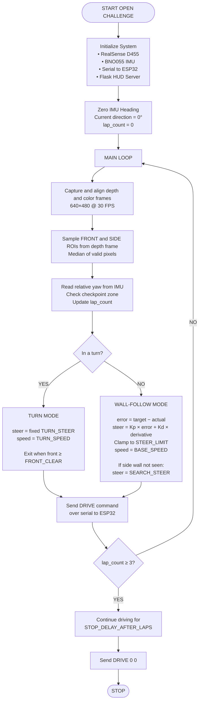
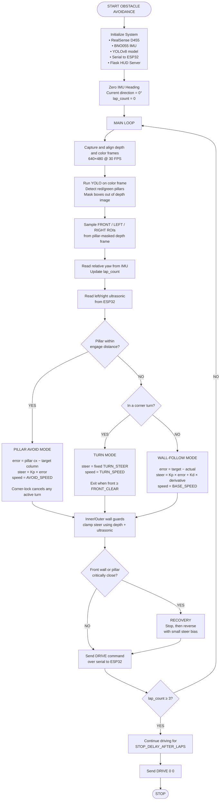

💻 Control software
====
This directory contains the control software used by our vehicle to participate in the **WRO 2026 Future Engineers** competition, developed entirely by our team. It includes all code, trained models, and dependency information required to build and run the robot's autonomous behavior for both the Open Challenge and Obstacle Avoidance rounds.

## 🧠 Our Approach

Our robot navigates using the Intel RealSense D455 depth camera as its primary spatial sensor, supplemented by the BNO055 IMU for heading and, in the obstacle round, ultrasonic sensors for redundant close-range sensing.

We chose wall following as our core navigation strategy for a simple reason: with a camera as the primary spatial sensor, walls are the most consistent and reliable reference we can measure. They give a stable, low-noise signal that doesn't depend on track markings or lighting conditions the way pure visual line-following would. This choice also produces smooth, repeatable paths and keeps the robot at a safe, predictable standoff from the track boundary, even with small variations in how the track is physically built.

Because our entire navigation strategy rests on a single depth signal, most of our engineering effort went into making that signal as clean and responsive as possible — filtering noisy depth readings, using median sampling instead of raw pixel reads, and tuning a PD controller so the robot reacts quickly to error without oscillating. The Jetson handles all sensing, vision, and decision-making; it then sends simple, low-level drive commands to an ESP32 over serial, which is responsible only for actually driving the motors and steering servo.

## 🤖 AI Model

While the Open Challenge relies purely on depth-based wall following, the Obstacle Avoidance round additionally requires the robot to recognize and react to colored pillars and the parking signal. For this, we use a custom-trained **YOLOv8n** object detection model, which is the primary way our robot perceives obstacles.

#### 🎯 What it detects

| Class | Detect Object | Robot Action |
|-------|---------------|--------------|
| 0 | **Green Obstacle Pillar** (`greenbox`) | Robot turns/passes to the **left** |
| 1 | **Red Obstacle Pillar** (`redbox`) | Robot turns/passes to the **right** |
| 2 | **Parking Marker** (`xparking`) | Robot detects and aligns with the **parking space** |

#### 🏋️ Training details

- **Base architecture:** YOLOv8n (nano) — chosen for its speed/accuracy tradeoff, so it can run in real time on the Jetson alongside the depth-processing pipeline.
- **Input size:** 640×640
- **Epochs:** 100 (batch size 8, auto optimizer, lr0 = 0.01)
- **Dataset:** Custom-labeled images of the competition field's red/green pillars and the parking marker, captured under varied lighting and distances.
- **Validation performance:** precision ≈ 0.997, recall ≈ 0.985, mAP@50 ≈ 0.995, mAP@50-95 ≈ 0.928.
- **Weights file:** `best1.pt` — the best checkpoint by validation fitness, used directly for inference on the robot.

#### ⚙️ How it fits into the pipeline

1. **Color frame → YOLO inference.** Each color frame from the RealSense D455 is passed through the YOLOv8 model to detect and classify `greenbox`, `redbox`, and `xparking` instances, returning bounding boxes and confidence scores.
2. **Depth fusion.** The pixel location of each detected box is cross-referenced with the aligned depth frame to estimate the obstacle's real-world distance and lateral offset, not just its position in the 2D image.
3. **Decision logic.** Based on the detected class, the robot computes a steering offset to pass green pillars on the right and red pillars on the left, while the underlying wall-following PD controller continues to handle smooth trajectory correction.
4. **Parking maneuver.** Once `xparking` is detected and the robot has completed the required laps, detections of this class are used to align the robot with the parking space and trigger the final parking sequence.
5. **Ultrasonic backup.** Ultrasonic sensors provide redundant close-range confirmation so a missed or late detection doesn't result in a collision.

Because object detection only needs to run during the Obstacle Avoidance round, YOLO inference is disabled entirely during the Open Challenge to save compute and keep the depth-based control loop running at full speed.

### 🏁 Open Challenge
#### 📋 Challenge Requirements

The Open Challenge requires the robot to autonomously complete 3 laps around the track, staying within track boundaries and avoiding contact with the walls. There are no pillars or fixed obstacles in this round — the only challenge is smooth, accurate navigation and reliable lap counting.

Since the direction of travel (clockwise or counter-clockwise) is only revealed just before the run starts, our robot needs to be able to run in either direction. We solved this by building two interchangeable driving programs:

| Mode | Wall Followed | Turn at Corners |
|------|---------------|-----------------|
| `clockWise.py` | Left wall | Turns **right** |
| `counterClockWise.py` | Right wall | Turns **left** |

#### 🧭 Navigation Per File

**Left Wall Following (clockWise.py)**
- Follows the left wall and uses the LEFT ROI to keep a consistent distance.
- If the robot is too far from the left wall, it steers right toward the wall.
- If it is too close, it steers left away from the wall.
- At a corner, it makes a fixed right turn (TURN_STEER = +30°) until the path ahead is clear.
- If the left wall cannot be detected, it gently steers left to search for it again.
- Lap checkpoints are detected in the order 90° → 180° → 270° → 0°.

**Right Wall Following (counterClockWise.py)**
- Follows the right wall and uses the RIGHT ROI to keep a consistent distance.
- If the robot is too far from the right wall, it steers right toward the wall.
- If it is too close, it steers left away from the wall.
- At a corner, it makes a fixed left turn (TURN_STEER = −32°) until the path ahead is clear.
- If the right wall cannot be detected, it gently steers right to search for it again.
- Lap checkpoints are detected in the order 270° → 180° → 90° → 0°.

#### 🎯 Our Strategy

1. **Depth camera for navigation, IMU for lap counting**  
   In the Open Challenge, steering relies entirely on the RealSense D455 depth stream. YOLO and ultrasonic sensors are not used because there are no pillars to detect. The BNO055 IMU runs
   alongside the camera and is used only to track heading and count laps, not for steering.
3. **Two regions of interest (ROIs) are read from each depth frame**  
- FRONT ROI: Centered in the frame and used to detect an approaching wall or corner.
- SIDE ROI: Located on the left or right depending on the mode, and used to measure the robot’s distance from the wall it is following.
3. **PD controller for wall following**  
  The PD controller converts the side-wall distance error into a steering angle. The further the robot is from the target distance, the stronger it steers back toward the wall. The  derivative term helps reduce overshooting and oscillation.
4. **Fixed steering at corners.**  
  When a corner is detected because the front distance drops below a threshold, the robot temporarily stops using the side-wall PD controller and steers at a fixed angle until the path
  opens up again. This is more reliable for sharp corners than trying to follow the wall using PD control.
5. **Heading-based lap counting.**  
  Lap counting is handled independently from vision using the IMU’s heading. This makes lap counting more reliable even if the camera temporarily loses track of the wall.

#### 📉 System Workflow

### 🧱 Obstacle Avoidance
#### 📋 Challenge Requirements

The Obstacle Avoidance round requires the robot to complete 3 laps around the track while additionally detecting and correctly passing colored pillars placed along the path — green pillars must be passed on one side, red pillars on the other — without touching them or the track walls, and finally parking in a marked bay once the laps are complete.

As with the Open Challenge, the direction of travel is only revealed just before the run, so we again built two interchangeable driving programs, this time layering AI-based pillar detection and ultrasonic backup sensing on top of the same wall-following foundation:

| Mode | Wall Followed | Turn at Corners | Pillar Pass Direction |
|------|---------------|------------------|------------------------|
| `obs_closewise.py` | Left wall | Turns **right** | Green → **left**, Red → **right** |
| `obs_counterclockwise.py` | Right wall | Turns **left** | Green → **left**, Red → **right** |

#### 🧭 Navigation Per File

**Left Wall Following + Obstacle Avoidance (`obs_clockwise.py`)**
- Follows the **left wall** using a PD controller.
- Makes a fixed **right turn** at corners and slows the turn as it gets close to the inner wall.
- Uses YOLO (`best1.pt`) to detect red and green pillars.
- Removes detected pillars from the depth data so they are not confused with the wall.
- Green pillars: steers left. Red pillars: steers right.
- Uses steering limits and ultrasonic sensors to prevent hitting the walls.
- Uses a corner-lock system so pillar avoidance has priority during turns.
- Stops and reverses briefly if a wall or pillar becomes dangerously close.
- Counts laps using the 90° → 180° → 270° → 0° checkpoints.

**Right Wall Following + Obstacle Avoidance (`obs_counterclockwise.py`)**
- Follows the right wall using a PD controller.
- Uses a fixed turning direction at corners for more reliable navigation.
- Uses YOLO (`best1.pt`) to detect and track pillars.
- Red pillars: steers left and follows the right wall.  
  Green pillars: steers right and follows the left wall.
- Adjusts steering based on the pillar's position and distance.
- Uses predictive steering to react before reaching a corner.
- Uses ultrasonic sensors as an additional safety system.
- Automatically calibrates the ultrasonic readings with the depth camera.
- Uses a corner-lock system to prioritize pillar avoidance during turns.
- Counts laps using IMU yaw instead of checkpoint zones.
  
#### 🎯 Our Strategy

1. **Depth camera for navigation and pillar ranging, YOLO for classification, IMU for lap counting.**  
   Steering during normal driving still relies entirely on the RealSense D455 depth stream, exactly as in the Open Challenge. YOLOv8 (`best1.pt`) is added purely to classify red vs. green pillars and locate them in the frame; the depth frame is then used to measure how far away each detected pillar actually is and to remove it from the wall-following ROIs.
2. **Column-based proportional avoidance instead of a fixed swing.**  
   Rather than steering a fixed amount whenever a pillar is seen, the controller computes an error between the pillar's current horizontal position and a target column, then steers proportionally — giving a smooth, continuously corrected pass rather than a single hard swerve.
3. **Independent wall-clearance guards as a safety net.**  
   Because wall-following, corner turns, and pillar avoidance can all issue a steering command in the same direction as a nearby wall, both directions of steering pass through dedicated inner-wall and outer-wall clearance guards before being sent to the motors — these only ever pull a dangerous steer back toward safe, never push it further into a wall.
4. **Ultrasonic sensors as a second, independent sensing layer.**  
   The RealSense depth ROIs and the ESP32's ultrasonic readings are treated as two independent measurements of the same wall; whichever one reports the more restrictive (closer) distance at any instant is the one that's obeyed, so a blind spot or dropout in one sensor doesn't remove the safety margin.
5. **Corner-lock and recovery for edge cases.**  
   A pillar appearing mid-turn cancels the turn and locks in pillar avoidance instead of fighting between the two behaviours every frame, and a stop-then-reverse recovery manoeuvre is triggered as a last resort if the front wall or a pillar gets dangerously close before the robot has fully cleared it.
6. **Heading-based lap counting, unchanged from the Open Challenge.**  
   Lap counting again runs independently of the vision pipeline using the IMU's heading, so it stays reliable even during active pillar avoidance, when the camera's attention is on the obstacle rather than the wall.

#### 📉 System Workflow

