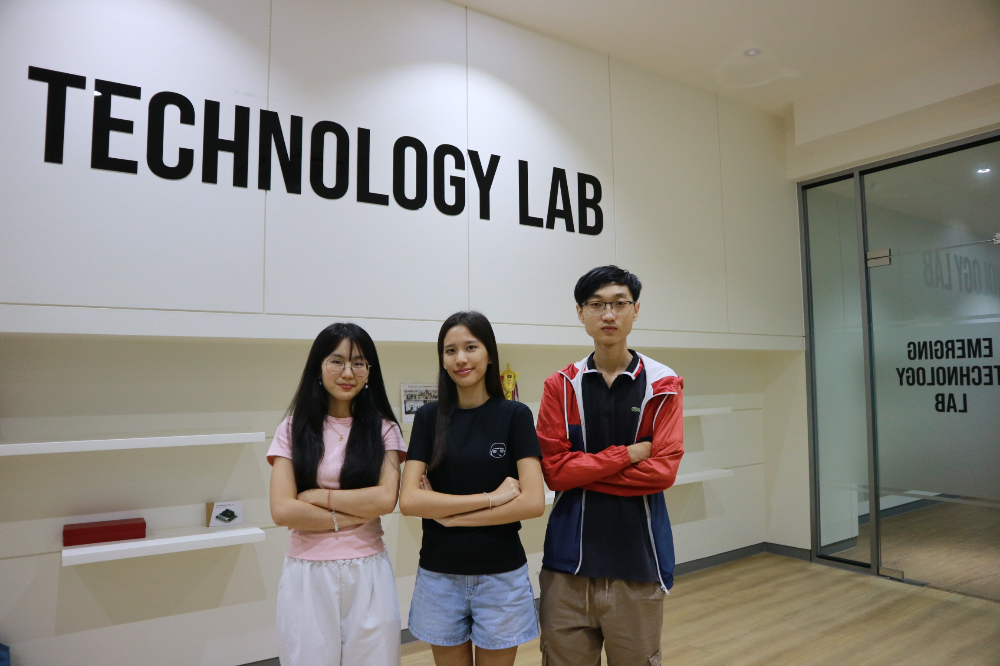

Team's photos
====
Official photographic documentation of Team IriSight from the American University of Phnom Penh (AUPP).

## About Our Team

_Team Photo - From left to right: Kimchour, Panha (Coach), Nita, and Muyleang._

## Team Members

### Member 1 — Ponlork Ponita

**Role:** 3D Design & Mechanical Engineer

**Introduction:**

Focused on the vehicle’s mechanical structure, CAD design, and 3D-printed components.

**Individual Contribution:**

* Led CAD design and 3D modeling of the Jetson, battery, motor, and camera mounts.
* Iterated through print-and-test fits to create a secure LEGO-compatible chassis.
* Created detailed blueprints documenting dimensions and materials.

### Member 2 — Taing Muyleang

**Role:** Electrical & Sensor Engineer

**Introduction:**

Responsible for the vehicle’s electrical system, power distribution, and sensor integration.

**Individual Contribution:**

* Developed the ESP32 firmware and Jetson control software.
* Implemented communication between microcontrollers and compute modules.
* Maintained the codebase and ensured reliable system integration.

### Member 3 — Luy Kimchour 

**Role:** Embedded & Software Engineer

**Introduction:**

Focused on system programming, communication between hardware, and overall software integration.

**Individual Contribution:**

* Provided technical guidance in mechanical, electrical, and software development.
* Mentored the team through testing, documentation, and integration.
* Advised on CAD optimization and autonomous vehicle control.

## Coach

### Coach — Chamroeun Vireakpanha

**Introduction:**

Guided the team with technical expertise, testing strategies, and competition-focused problem solving.

**Contribution:**

* Provided technical guidance in mechanical, electrical, and software development.
* Mentored the team through testing, documentation, and integration.
* Advised on CAD optimization and autonomous vehicle control.

## Team Contribution

Although each member has individual responsibilities, we work together throughout the project. Our combined contributions include:

* **Planning & Research**: Developing ideas and understanding the project requirements.
* **Design & Development**: Building and improving the project together.
* **Testing & Problem Solving**: Identifying issues and working together to find solutions.
* **Documentation**: Recording our progress, decisions, and results.

## Teamwork

Our team's success comes from combining our individual skills and supporting one another. Each member contributes to different parts of the project while collaborating on important decisions and challenges. With the guidance of our coach, we continuously learn, improve, and work toward achieving our common goal.
