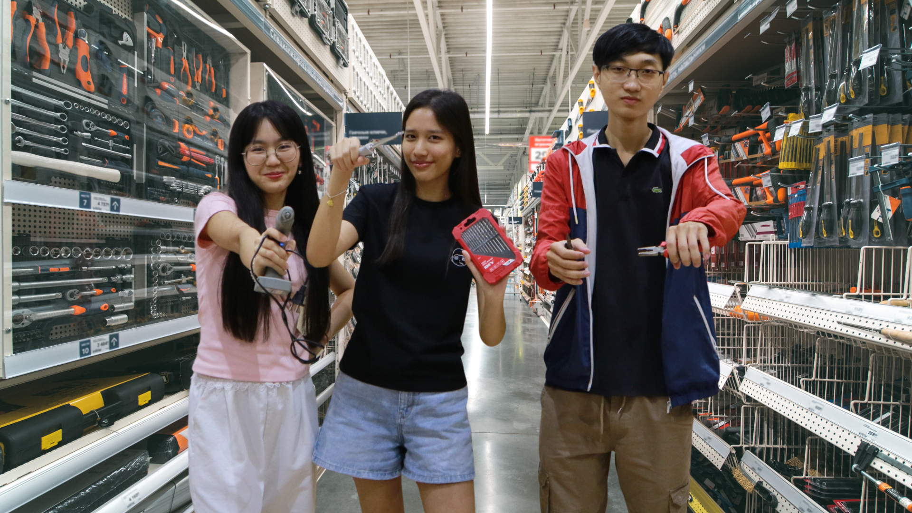

Team's photos
====
Official photographic documentation of Team Baymax Motion from the American University of Phnom Penh (AUPP).

## About Our Team

_Team Photo - From left to right: Kimchour, Panha (Coach), Nita, and Muyleang._

## Team Members

### Member 1 — [Name]

**Role:** [Role]

**Introduction:**
[Name] is responsible for [main responsibilities]. They contribute to the team through their skills in [skills/area] and help ensure that [specific contribution].

**Individual Contribution:**

* [Contribution 1]
* [Contribution 2]
* [Contribution 3]

### Member 2 — [Name]

**Role:** [Role]

**Introduction:**
[Name] focuses on [main responsibilities]. They contribute their knowledge of [skills/area] and work closely with the team to [specific contribution].

**Individual Contribution:**

* [Contribution 1]
* [Contribution 2]
* [Contribution 3]

### Member 3 — [Name]

**Role:** [Role]

**Introduction:**
[Name] is responsible for [main responsibilities]. Their main strengths include [skills/area], which support the team in [specific contribution].

**Individual Contribution:**

* [Contribution 1]
* [Contribution 2]
* [Contribution 3]

## Coach

### Coach — [Coach's Name]

**Introduction:**
[Coach's Name] is our team coach and provides guidance, advice, and support throughout the project. They help us improve our ideas, solve challenges, and stay focused on our goals.

**Contribution:**

* Provides technical and strategic guidance
* Reviews our progress and gives feedback
* Helps the team solve problems and make decisions
* Encourages teamwork and continuous improvement

## Team Contribution

Although each member has individual responsibilities, we work together throughout the project. Our combined contributions include:

* **Planning & Research** — Developing ideas and understanding the project requirements.
* **Design & Development** — Building and improving the project together.
* **Testing & Problem Solving** — Identifying issues and working together to find solutions.
* **Documentation** — Recording our progress, decisions, and results.
* **Presentation** — Preparing and presenting our final project as a team.

## Teamwork

Our team's success comes from combining our individual skills and supporting one another. Each member contributes to different parts of the project while collaborating on important decisions and challenges. With the guidance of our coach, we continuously learn, improve, and work toward achieving our common goal.
